# 基于 Gin 和 WebSocket 的 IM 即时通讯系统的设计与实现

## 任务书

### 主要内容

本课题中，学生需要设计并实现一个基于 Gin Web 框架与 WebSocket 长连接协议的 IM 即时通讯系统，整体采用前后端分离的工程组织方式。系统面向 Web 端用户，由 Gin 承担 RESTful 业务接口，由 WebSocket 承担聊天消息的实时双向推送，覆盖单聊、群聊、好友关系管理、朋友圈社交动态以及个性化主页装扮等核心业务场景，并在聊天通信链路上引入端到端加密机制，提升消息传输与存储过程中的安全性。具体要做的事情有：

（1）后端服务部分。学生需要使用 Go 语言以及 Gin Web 框架来搭建一套 RESTful API 服务，通过 GORM 框架对 MySQL 数据库进行操作，用 JWT 完成用户身份认证，并基于 Gorilla WebSocket 实现长连接以支撑单聊与群聊消息的实时下发；后端还需要集成 MinIO 对象存储来承载朋友圈图片上传，并通过 HTTP 客户端对接 DeepSeek 大模型 Chat Completions API，为前端提供朋友圈 AI 文案生成与润色服务。

（2）前端工程部分。学生需要采用 Vue 3 框架配合 Vite 构建工具与 TypeScript 编写前端工程，使用 Pinia 完成全局状态管理，使用 Vue Router 完成页面路由控制，使用 Axios 封装统一的 HTTP 请求层。前端还需要基于浏览器原生的 Web Crypto API 实现 RSA-OAEP 与 AES-GCM 端到端加密的整套加解密流程，并将私钥保存在浏览器本地，公钥上传到服务端。

（3）功能模块设计与实现。要完成用户注册与登录、个人资料维护、主页皮肤（个性装扮）切换、好友主页查看、好友申请发起与处理、好友列表管理、单聊实时收发、群聊创建与邀请、群聊消息发送、朋友圈发布与点赞评论、朋友圈 AI 文案助手、图片上传等核心功能模块，并保证整套业务链路可在浏览器端完整演示。

（4）安全设计与端到端加密实现。设计并实现单聊基于 RSA-OAEP + SHA-256 的双密文加密方案，以及群聊基于 AES-GCM-256 + RSA-OAEP 混合加密的方案；要做到聊天消息明文不落库，服务端仅保存与转发密文，所有加解密均在浏览器本地完成。

（5）系统测试与论文撰写。完成系统功能测试、性能测试与安全测试，对各模块进行验证与回归；按照学校规范撰写毕业设计论文，正文字数不少于 15000 字，论文中需要包含文献综述、需求分析、系统设计、系统实现、系统测试和总结等章节，并附上系统功能图、业务流程图、技术架构图、E-R 图、类图、活动图以及界面运行效果图。

通过完成本课题，学生可以深入掌握 Gin 框架的路由分组、中间件链与请求处理机制，理解 WebSocket 长连接在 IM 实时消息推送中的应用方式，并系统性地掌握 JWT 鉴权、端到端加密、对象存储、大模型应用集成等关键技术；同时具备从需求分析、原型设计到系统交付与论文写作的完整工程能力。

### 基本要求

在系统设计的时候，要综合考虑系统的可用性、可扩展性、可维护性与安全性。要严格遵守安全编码规范，防范 OWASP Top 10 中提到的常见风险，例如 XSS 攻击、SQL 注入、CSRF 攻击、未授权访问、明文密码存储、敏感信息泄露等；用户密码必须使用 bcrypt 加盐哈希进行处理，敏感配置信息（如数据库密码、JWT 密钥、DeepSeek API Key、MinIO Access Key）必须通过配置文件或环境变量统一管理，绝不写入前端或代码仓库；上传图片接口要严格校验文件类型为 `image/*` 并进行用户级目录隔离。

要使用业务流程图、用例图、用例说明、系统功能图、业务架构图、技术架构图、E-R 图、类图、活动图等多种 UML 制品对系统进行建模和描述，体现软件工程方面的能力。需要画出整体业务流程图、各角色用例图、系统功能模块图、分层技术架构图、E-R 图、核心模块的类图与活动图。前端界面要做到简洁、直观、操作流畅，能完整演示从注册到聊天、从添加好友到朋友圈互动的全链路场景。

时间节点要求：第 1 至第 2 周，完成文献翻译与文献综述工作；第 3 周，完成开题报告并参加开题答辩；第 8 周，进行期中检查并提交中期报告；第 15 周，完成论文的评阅、查重与修改完善；第 16 周，组织答辩。

### 思政要求

要培养精益求精的工匠精神，在接口规范、数据库范式、前端交互细节等方面反复打磨，追求高质量的工程产出；要有创新意识，主动引入端到端加密、大模型文案助手等新技术，并通过工程实践对比 RSA、AES、混合加密在不同场景下的适用性；要有强烈的用户隐私保护意识，理解聊天系统作为社交基础设施所承担的社会责任，认识到软件工程师在保护用户数据安全、防止系统被恶意利用方面应当承担的职业责任。

### 主要参考资料

[1] 谢希仁. 计算机网络[M]. 8版. 北京: 电子工业出版社, 2021.
[2] 门凯旋, 李天昊, 王广硕, 等. X3DH密钥协商协议演示系统的设计与实现[J]. 数字技术与应用, 2022, 40(2).
[3] 孟文胜. 基于国密算法的端到端加密即时通信系统设计与实现[J]. 电脑编程技巧与维护, 2026, (4).
[4] DeepSeek-AI. DeepSeek-V3 Technical Report[R/OL]. arXiv:2412.19437, 2024.

完成期限：2026 年 5 月 18 日
指导教师签名：
专业负责人签名：

---

## 摘 要

随着移动互联网与社交化应用的不断渗透，即时通讯（Instant Messaging，IM）已经成为人们日常沟通中最重要的基础设施之一。同时，由于聊天内容往往涉及大量私人信息，用户对消息传输与存储过程中的安全性提出了更高的要求，传统只在服务端保存明文的 IM 架构在隐私保护与数据安全方面逐渐显得力不从心。针对这一背景，本文设计并实现了一个基于 Gin 与 WebSocket 的 IM 即时通讯系统，整体采用前后端分离的工程组织方式，由 Gin 框架承担 RESTful 业务接口、由 WebSocket 长连接承担聊天消息的实时双向推送，覆盖单聊、群聊、好友关系、朋友圈社交动态等核心业务场景，并在通信链路上引入端到端加密机制，使服务端仅承担密文存储与转发职责。

系统后端基于 Go 语言与 Gin 框架开发：Gin 借助路由分组、参数绑定与中间件链承载注册登录、好友关系、历史消息、朋友圈、图片上传、AI 文案助手等 RESTful 接口；Gorilla WebSocket 与自研的 Hub 连接管理器一起承担聊天消息的实时下发；GORM 操作 MySQL 完成业务数据持久化，JWT 完成无状态身份认证；MinIO 对象存储承载朋友圈图片，DeepSeek 大模型 Chat Completions API 提供朋友圈 AI 文案助手。前端基于 Vue 3、Vite、TypeScript、Pinia、Vue Router 与 Axios 构建，使用浏览器原生 Web Crypto API 完成 RSA-OAEP 与 AES-GCM 的端到端加解密。功能上，系统实现了用户注册登录与个人资料维护、五种主页皮肤个性装扮、好友主页查看、好友申请与处理、好友列表查询、单聊与群聊实时通信、单聊基于 RSA-OAEP 的双密文加密、群聊基于 AES-GCM + RSA-OAEP 的混合加密、朋友圈图文动态发布、点赞与评论、朋友圈 AI 文案生成与润色、图片上传等功能。系统在功能完整性、消息实时性与端到端加密安全性方面均得到了较好的验证，能够满足课程设计与小型社交场景下的即时通讯需求。

**关键词** 即时通讯；Gin；WebSocket；端到端加密；Vue 3；DeepSeek

---

## ABSTRACT

With the continuous penetration of mobile Internet and social applications, Instant Messaging (IM) has become one of the most important infrastructures in daily communication. At the same time, because chat content often involves a large amount of private information, users have placed higher requirements on the security of message transmission and storage. Traditional IM architectures that only store plaintext on the server side gradually appear inadequate in terms of privacy protection and data security. Against this background, this thesis designs and implements a Web-based IM instant messaging system based on the Gin web framework and the WebSocket protocol, in which Gin serves the RESTful business APIs while WebSocket long connections are dedicated to real-time bidirectional chat message delivery. The system covers the core business scenarios of one-to-one chat, group chat, friend relationships and Moments-style social feeds, and introduces an end-to-end encryption mechanism into the communication chain so that the server only undertakes the responsibility of ciphertext storage and forwarding.

The back end of the system is built with Go and the Gin framework. Gin carries the RESTful APIs for registration and login, friend relationships, history messages, Moments, image upload and the AI copywriting assistant through its route grouping, parameter binding and middleware chain; Gorilla WebSocket, together with a self-designed Hub for connection management, handles the real-time pushing of chat messages; GORM operates MySQL for business data persistence and JWT is used for stateless authentication; MinIO object storage hosts the Moments images, and the DeepSeek LLM Chat Completions API provides the Moments AI copywriting assistant. The front end is built with Vue 3, Vite, TypeScript, Pinia, Vue Router and Axios, and uses the browser-native Web Crypto API to perform RSA-OAEP and AES-GCM end-to-end encryption and decryption. Functionally, the system implements user registration and login, profile management, five homepage skins for personalization, friend homepage browsing, friend requests, friend list, one-to-one and group chats with real-time delivery, RSA-OAEP-based dual-ciphertext encryption for one-to-one chat, AES-GCM + RSA-OAEP hybrid encryption for group chat, Moments publishing with images, likes and comments, AI-assisted Moments copywriting, and image upload. The system has been well verified in terms of functional completeness, real-time messaging and end-to-end encryption security, and can meet the IM requirements of course projects and small social scenarios.

**KEY WORDS** Instant Messaging; Gin; WebSocket; End-to-End Encryption; Vue 3; DeepSeek

---

## 目  录

- 摘  要
- ABSTRACT
- 1 绪论
  - 1.1 研究背景及意义
  - 1.2 国内外研究现状
  - 1.3 研究内容
  - 1.4 章节安排
- 2 相关技术介绍
- 3 系统分析
  - 3.1 系统可行性分析
  - 3.2 系统业务流程分析
  - 3.3 系统功能需求分析
  - 3.4 系统非功能需求分析
- 4 系统设计
  - 4.1 系统总体设计
  - 4.2 系统数据库设计
  - 4.4 系统功能详细设计
- 5 系统实现
- 6 系统测试
- 结束语
- 参考文献

---

## 1 绪论

本章介绍系统的研究背景及意义、国内外研究现状、本课题主要的研究内容以及论文整体的章节安排，为后续章节展开系统的需求分析、设计与实现奠定基础。

### 1.1 研究背景及意义

进入移动互联网时代以来，即时通讯（Instant Messaging，IM）已经从早期单纯的"在线消息收发"工具，演化为以社交关系链为核心的综合性互联网基础设施。微信、QQ、WhatsApp、Telegram、Slack 等典型即时通讯产品，已经在个人社交、家庭沟通、工作协作、政企办公等场景中承担了不可替代的作用。根据公开统计资料显示，仅微信一款产品的月活跃用户在 2024 年已经突破 13 亿，每天产生的消息总量超过千亿条。即时通讯应用已经事实上成为社交关系流转、信息分发与轻量内容生产的主要载体。

随着用户对在线沟通依赖程度的不断加深，聊天系统中沉淀的个人隐私信息也呈指数级增长。用户与好友间的对话、群聊中的工作讨论、朋友圈中的生活动态，都可能包含位置信息、健康信息、财务信息、身份证件号、密码、商业机密等敏感数据。如果即时通讯系统在传输或存储过程中存在安全短板，一旦数据库被拖库、运维人员越权访问或通信链路被中间人窃听，将带来严重的隐私泄露风险。近年来，社交聊天软件因明文存储、运维人员私自查询、客服系统泄露聊天截图等导致的隐私事件不绝于耳，使得"端到端加密（End-to-End Encryption，E2EE）"成为现代 IM 系统不可绕开的设计议题。WhatsApp、Signal、Telegram 秘密聊天等产品先后引入了端到端加密机制，国内的微信也逐步在部分场景中尝试更严格的密钥管理策略。

另一方面，社交属性正在不断丰富即时通讯产品的功能边界。除单聊外，群聊、朋友圈动态、个性化主页装扮、AI 智能助手等已经成为现代社交应用的"标配"功能。以朋友圈为例，它将社交关系链从"一对一沟通"扩展到了"一对多动态分享"，同时承担了内容生产、情感表达、群体认同等多重功能；以 AI 文案助手为例，伴随着大语言模型（LLM）能力的持续提升，越来越多的社交产品尝试在内容发布、回复建议、配图描述等环节嵌入 AI 能力，以降低用户的内容生产门槛。

在以上背景下，本课题面向 Web 端设计并实现了一个具备完整社交链路与端到端加密能力的即时通讯系统。系统的研究与实现意义主要体现在以下几个方面：

第一，工程实践意义。系统综合运用了前后端分离架构、Vue 3、TypeScript、Go、Gin、GORM、WebSocket、MySQL、MinIO、JWT、Web Crypto API、大模型 API 等多种现代 Web 工程领域的关键技术，能够帮助开发者深入理解并实践一套完整的、可演示、可扩展的 Web 应用工程。

第二，安全实践意义。系统将端到端加密机制贯穿到单聊与群聊两类典型消息场景中。单聊基于 RSA-OAEP + SHA-256，群聊基于 AES-GCM-256 + RSA-OAEP 的混合加密方案，所有加解密均在浏览器本地完成，服务端不接触消息明文。该实现可以作为高校教学与课程设计中讲解端到端加密的"可运行"案例。

第三，社交场景的探索意义。系统将朋友圈动态、个性化主页皮肤、AI 文案助手等社交化能力与传统 IM 聊天打通，形成"聊天 + 社交动态 + 个性装扮 + AI 助手"四位一体的轻量社交闭环，为类似规模的社交应用提供了较为完整的参考实现。

### 1.2 国内外研究现状

国外方面，以 WhatsApp、Signal、iMessage 为代表的即时通讯产品已经将基于 Signal Protocol 的端到端加密引入到生产环境。Cohn-Gordon 等给出了 Signal 协议的形式化安全证明[1]，其核心思想是通过 X3DH 密钥协商协议[2]与 Double Ratchet 双棘轮算法[3]，为每对用户、每个会话、每条消息独立派生密钥，实现前向保密与后向保密；Telegram 在普通聊天中采用客户端到服务端加密，并提供基于 MTProto 协议的"秘密聊天"模式以支持端到端加密。Matrix/Element 等开源 IM 协议则将 Megolm 群组棘轮协议作为群聊场景的核心方案。这些产品在密钥管理、设备同步、群成员变更等方面已经形成了相对完整的工程实践。

国内方面，微信、QQ、钉钉、飞书等主流 IM 产品在传输层使用了 TLS，并在数据库侧采用了多种合规性加密手段，但出于运营审核、合规要求等原因，多数场景下并未采用严格意义上的端到端加密。这一方面是因为聊天明文涉及《信息安全技术 个人信息安全规范》中"敏感个人信息"的处理边界[4]，另一方面是出于运营审计与合规留痕的现实约束。学术界则从消息加密、群组密钥分发、多端密钥同步、可证安全等多个角度对 IM 安全展开了深入研究，例如陈果等对面向 Web 的端到端加密 IM 系统进行了原型实现[5]；底层通信协议方面，Fette 等在 RFC 6455 中正式定义了 WebSocket 协议[6]，国内学者随后围绕该协议的实时通信能力开展了系统化研究[7]。

在工程实现层面，前后端分离架构与 WebSocket 长连接相结合的设计模式已经成为 Web 端 IM 系统的事实标准。前端框架以 React、Vue、Angular 三大主流框架为代表，其中 Vue 3 + Composition API + TypeScript 的组合在国内 Web 项目中应用广泛；后端语言上，Go、Node.js、Java 是 IM 类项目使用最多的三种语言，其中 Go 凭借其原生并发模型、协程调度器与简洁的语法，已经成为高并发实时通讯类应用的主流选择[8]。

在大模型应用层面，自 OpenAI 推出 ChatGPT 以来，DeepSeek、智谱、阿里通义千问、月之暗面 Kimi 等国产大模型相继推出 Chat Completions API，使得普通 Web 应用可以以极低的成本接入大模型能力。Lewis 等提出的检索增强生成（RAG）框架奠定了"大模型 + 外部知识"应用范式的基础[9]；DeepSeek-V3 通过 MoE 架构与 FP8 混合精度训练在保持高质量输出的同时大幅降低了推理成本[10]；以 LLaMA 为代表的开源模型则进一步推动了大模型在中小型应用中的落地[11]，这些进展共同为本系统"朋友圈 AI 文案助手"的实现提供了直接的技术参考。

综合来看，现有 IM 系统的研究与实现已经较为成熟，但围绕"轻量化 + 端到端加密 + 社交动态 + AI 辅助"四者结合的 Web 端原型相对较少，且面向高校教学与毕业设计场景的"可读、可演示"案例更为稀缺。本课题正是在这一背景下展开研究与实现工作。

### 1.3 研究内容

本课题围绕"基于 Gin 和 WebSocket 的 IM 即时通讯系统"展开，主要开展以下五个方面的研究与实现工作：

（1）基于 Gin 的 RESTful 后端与 WebSocket 实时推送架构设计。设计并实现以 Gin 框架承载 HTTP RESTful API、以 WebSocket 长连接承载实时消息推送的混合架构。后端基于 Go 1.22 + Gin + GORM + MySQL 构建，通过 Gin 的中间件链实现 JWT 鉴权、CORS、统一错误处理等横切关注点；通过 Gorilla WebSocket 与自研的 Hub 实现按用户 ID 路由的实时消息分发。前端基于 Vue 3 + Vite + TypeScript + Pinia + Vue Router + Axios 构建，与后端形成清晰的前后端分离工程结构。

（2）社交关系与即时聊天功能的设计与实现。包括用户注册登录、JWT 身份认证、个人资料管理、好友申请发起与处理、好友列表查询、好友主页查看、单聊实时消息收发、群聊创建邀请退出、群聊实时消息收发等核心功能。

（3）端到端加密机制的设计与实现。单聊采用基于 RSA-OAEP + SHA-256 的"双密文"加密方案，发送方与接收方各持一份可由自己私钥解密的密文；群聊采用基于 AES-GCM-256 + RSA-OAEP 的混合加密方案，正文采用 AES-GCM 一次加密、AES 会话密钥再由每位群成员的 RSA 公钥分别包裹。所有加解密均在浏览器本地完成，服务端只存储与转发密文。

（4）朋友圈社交动态与个性化主页装扮模块的设计与实现。实现朋友圈动态发布、图片上传（基于 MinIO 对象存储）、点赞、评论、删除等功能；引入主页皮肤（aurora、sunset、galaxy、mint、peach 五种预设）实现用户个性化主页装扮；好友主页支持装扮 + 朋友圈一体化展示。

（5）基于 DeepSeek 大模型的 AI 文案助手模块的设计与实现。在朋友圈发布页提供"想法生成文案"与"对已有文案润色"两种模式，并支持自然、治愈、文艺、搞笑等语气选项，借助 DeepSeek Chat Completions API 实现实际文案生成。

### 1.4 章节安排

全文共分六章，整体安排如下：第 1 章为绪论，介绍研究背景及意义、国内外研究现状、研究内容与章节安排；第 2 章介绍系统开发涉及的关键技术与框架；第 3 章对系统进行需求分析，包括可行性分析、业务流程分析、功能需求分析与非功能需求分析；第 4 章对系统进行总体设计与详细设计，包括功能架构、业务架构、技术架构、E-R 图、数据表与各模块详细设计；第 5 章对系统实现进行说明，展示主要模块的实现细节与运行效果图；第 6 章对系统进行功能测试与非功能测试。最后是结束语与参考文献。

---

## 2 相关技术介绍

本章对系统开发过程中使用到的关键技术与框架进行简要介绍，便于读者理解后续章节中系统设计与实现部分的技术选型依据。本系统所涉及的底层网络与传输知识均以谢希仁《计算机网络》中关于 HTTP、TCP、WebSocket 与 TLS 的描述作为基础参考[12]。

**Vue 3 与 Composition API。** Vue 3 是当下国内使用最广泛的渐进式前端框架之一，相比 Vue 2，其在响应式系统（基于 Proxy 重写）、组件 API（引入 Composition API）、性能表现（Diff 算法优化、Tree-Shaking 支持）等方面进行了系统性升级。本系统的前端工程基于 Vue 3 与 `<script setup>` 语法糖编写，并配合 TypeScript 提供完整的静态类型检查。Vite 作为新一代前端构建工具，基于浏览器原生 ESM 实现近乎即时的开发热更新，本系统使用 Vite 5 作为开发与构建工具链。Pinia 是 Vue 官方推荐的状态管理库，本系统使用 Pinia 维护用户认证状态、好友列表、群聊状态、聊天消息等全局数据；Vue Router 4 用于实现前端路由控制；Axios 用于统一封装 HTTP 请求并与后端 JWT 鉴权配合。

**Go 语言与 Gin Web 框架。** Go 是 Google 开源的静态强类型编译型语言，其原生 goroutine 协程模型与 channel 通信机制天然适合高并发网络服务的开发，相关语言特性可参见 Donovan 与 Kernighan 的权威著作[13]。本系统后端基于 Go 1.22 编写，使用 Gin 作为 Web 框架。Gin 是 Go 生态中性能最高、使用最广的 HTTP 框架之一，提供路由分组、中间件链、参数绑定、JSON 序列化等开箱即用的能力。借助 Gin 的中间件机制，本系统将 JWT 身份认证、跨域处理（CORS）、请求体大小限制、统一错误处理等横切关注点优雅地封装到中间件层。

**GORM 与 MySQL。** GORM 是 Go 语言生态下最成熟的 ORM 框架，支持自动迁移、关联查询、事务、钩子、软删除、原生 SQL 兜底等能力。本系统使用 GORM 操作 MySQL 8 数据库，并通过参数绑定的方式有效防范 SQL 注入。MySQL 作为成熟的关系型数据库，支持事务、外键约束、唯一索引等关键能力，本系统中的用户、好友关系、消息、群组、朋友圈等业务数据均存储在 MySQL 中，并通过外键约束保障业务一致性。

**WebSocket 与 Gorilla WebSocket。** WebSocket 是建立在 TCP 之上的全双工通信协议，能够在客户端与服务端之间建立持久化连接，避免了 HTTP 短轮询带来的开销与延迟，协议细节由 IETF RFC 6455 正式定义[6]。本系统使用 Gorilla WebSocket 库作为后端 WebSocket 实现，并自行设计了基于用户 ID 的 Hub 结构来维护在线连接，实现"发消息时根据接收方/群成员查找对应连接并实时推送"。前端通过浏览器原生 `WebSocket` API 与服务端通信。

**JWT 身份认证。** JSON Web Token（JWT）是一种基于 JSON 的、用于在网络应用之间安全传递身份信息的开放标准，由 Header、Payload 与 Signature 三部分组成，由 IETF RFC 7519 规范化[14]。本系统采用 JWT 实现无状态身份认证：用户登录成功后由后端签发一个携带 `userId` 与过期时间的 Token，前端将 Token 保存到浏览器 `localStorage` 中，并在后续 HTTP 请求的 `Authorization: Bearer <token>` 头部以及 WebSocket 连接的 `?token=xxx` 查询参数中携带。

**bcrypt 密码哈希。** bcrypt 是 Provos 与 Mazières 在 1999 年提出的基于 Blowfish 的自适应密码哈希算法，通过加盐与代价因子（cost）可以有效防御彩虹表攻击与暴力破解[15]。本系统使用 `golang.org/x/crypto/bcrypt` 包对用户密码进行哈希存储，绝不在数据库中保存任何形式的明文密码。

**Web Crypto API、RSA-OAEP 与 AES-GCM。** Web Crypto API 是 W3C 定义的、浏览器原生提供的低层密码学接口，覆盖随机数生成、对称/非对称加密、签名、密钥派生、密钥导出与导入等能力[16]。本系统在前端基于 Web Crypto API 实现了两套端到端加密方案：单聊采用 RSA-OAEP + SHA-256，密钥长度为 2048 位；群聊采用 AES-GCM-256 加密正文，AES 会话密钥再由 RSA-OAEP 包裹。RSA-OAEP 由 Bellare 与 Rogaway 提出，是一种基于"最优非对称加密填充"的 RSA 加密变种，能够抵抗选择密文攻击[17]；AES-GCM 则是 NIST SP 800-38D 中定义的带认证的对称加密算法，既能保证机密性也能保证完整性[18]。在我国密码合规层面，相关公钥密码算法可参考国家标准 GB/T 32918—2016 中规定的 SM2 椭圆曲线公钥密码算法[19]。

**MinIO 对象存储。** MinIO 是一款高性能、兼容 AWS S3 协议的开源对象存储系统，常用于私有云与混合云环境下的非结构化数据存储。本系统将朋友圈图片上传到 MinIO 桶中，每个用户的图片按 `uploads/users/{userId}/{nanoTimestamp}{ext}` 的规则隔离存放，前端拿到的是直接可访问的公开 URL。当部署环境没有 MinIO 时，系统也支持降级为本地静态目录托管。

**DeepSeek 大语言模型。** DeepSeek 是国内开源的高性能大语言模型，提供了与 OpenAI Chat Completions 兼容的 HTTP API。本系统借助 DeepSeek API 实现朋友圈 AI 文案助手，将"用户的想法 / 草稿 + 语气 + 是否带图"组织成提示词，由模型返回 1～3 句中文社交平台风格的朋友圈文案。AI 调用所需的 `DEEPSEEK_API_KEY` 仅保存在后端配置中，不下发到前端，避免密钥泄露。

**TypeScript。** TypeScript 在 JavaScript 之上引入了静态类型系统，可以在编译期捕获大量类型错误，并显著改善 IDE 的提示与重构体验。本系统前端工程全量采用 TypeScript 编写，对接口请求体、响应体、Pinia store 状态、组件 props 与 emit 事件均进行了严格的类型声明，提升了大型前端工程的可维护性。

---

## 3 系统分析

本章在第 1、2 章背景介绍与技术介绍的基础上，对系统进行可行性分析、业务流程分析、功能需求分析与非功能需求分析，明确系统的边界、用户角色、功能集合与质量属性，为后续的系统设计提供依据。

### 3.1 系统可行性分析

系统可行性分析是软件工程项目立项前必须进行的一项关键工作，其目的在于从技术、经济、环境、法律四个维度评估项目是否具备实施条件。本节结合本课题的实际定位（面向 Web 端的轻量级 IM 系统）从以下四个方面对系统的可行性进行论证。

#### 3.1.1 技术可行性

本系统在技术选型上全部基于业界已经广泛验证的开源框架与协议，具备完整的技术可行性。前端方面，Vue 3、Vite、TypeScript、Pinia 与 Vue Router 是当下国内 Web 工程的事实标准技术栈，社区生态成熟、文档齐全，能够支撑从原型开发到大型工程演进的全流程。后端方面，Go 语言原生支持高并发 goroutine 与 channel 通信，Gin 框架的吞吐性能在主流 Go Web 框架中名列前茅，足以满足本系统的并发要求；GORM 与 MySQL 的组合在 CRUD、事务、外键约束等方面表现稳定。实时通信方面，WebSocket 协议是 W3C 与 IETF 联合制定的国际标准（RFC 6455），浏览器与 Gorilla WebSocket 库均提供完整支持，可以稳定承载本系统所需的"在线状态 + 实时推送"能力。

端到端加密方面，浏览器原生 Web Crypto API 已经在所有主流浏览器中得到广泛实现（Chrome、Edge、Firefox、Safari 均已支持 RSA-OAEP 与 AES-GCM），无需引入额外的密码学库即可在前端完成 2048 位 RSA 密钥对生成、AES-GCM 256 位会话密钥生成与加解密。对象存储方面，MinIO 完全兼容 AWS S3 协议且单机部署门槛低；大模型方面，DeepSeek 提供与 OpenAI Chat Completions 兼容的 HTTP API，可以通过简单的 HTTP 客户端完成对接。综上所述，本系统所涉及的全部关键技术均已成熟可用，技术可行性是充分的。

#### 3.1.2 经济可行性

经济可行性主要从投资估算、资金筹措、社会效益与经济效益四个角度进行分析。投资估算方面，本系统是面向毕业设计的轻量级 Web 应用，其全部依赖均为开源软件（Go、Gin、GORM、MySQL Community Edition、Vue、Vite、MinIO 等），开发与运行环境无需购买任何商业授权；唯一可能产生支付费用的是 DeepSeek API 调用，当前 DeepSeek-V3 的调用价格为每百万 Token 约 2 元人民币，本系统的朋友圈 AI 文案助手每次调用消耗 Token 通常在 200～500 之间，单次调用成本远低于 0.01 元，即使日均调用上千次，月均成本也不超过 50 元，开发者完全可以负担。资金筹措方面，本系统作为学生毕业设计项目，所需的硬件资源（笔记本电脑、本地 MySQL、本地 MinIO）均可由开发者已有的开发环境承担，无需额外采购。

社会效益方面，系统将端到端加密、社交动态、AI 文案助手等现代 Web 应用关键能力集中呈现，可以作为高校教学过程中讲解端到端加密与现代社交应用架构的"可运行"案例，具备较强的教学示范价值。经济效益方面，本系统短期内并不直接追求商业化变现，但其架构具备较强的可扩展性：在补充移动端、引入企业版鉴权与审计、对接更多大模型能力之后，有潜力演化为面向中小团队的私有化 IM 解决方案。综合来看，系统的经济可行性是充分的。

#### 3.1.3 环境可行性

环境可行性主要从环境影响分析与环境效益两个角度进行考量。环境影响方面，本系统是一个纯软件项目，从开发到部署都没有物理生产环节，对自然资源的直接消耗几乎为零；运行时所需的计算资源也十分有限，单机 MySQL + MinIO + Go 进程 + 浏览器即可承载本系统全部功能演示，对电力的消耗远小于本地训练大模型类项目。

环境效益方面，本系统通过将朋友圈动态、好友关系、聊天记录等社交数据集中线上化，能够替代部分线下纸质沟通与电话沟通场景，间接降低了纸张、墨水等物质消耗；同时，AI 文案助手的引入提升了内容创作效率，减少了用户在反复修改文案时的设备能耗。综合来看，系统在环境层面具有正向的影响，环境可行性是充分的。

#### 3.1.4 法律可行性

法律可行性主要从合规性与用户隐私保护两个方面进行论证。合规性方面，本系统所采用的全部第三方依赖均使用 MIT、Apache 2.0、BSD 等宽松开源协议，可以在毕业设计与商业用途中合法使用；DeepSeek API 的接入遵循其官方服务条款，且 API Key 仅保存在后端配置中，避免了密钥泄露与滥用。

用户隐私保护方面，本系统在设计上贯彻了"最小必要"原则：用户注册时只采集用户名与密码，不强制采集手机号、身份证号等敏感信息；密码使用 bcrypt 加盐哈希后再存储，绝不保存任何形式的明文密码；聊天消息明文不落库，服务端只保存密文与算法标识，从根源上规避了"聊天日志被运维查看"的风险；好友主页与朋友圈接口在服务端做严格的可见性校验，非好友访问会被直接拦截；图片上传按用户分目录隔离，避免越权访问。这些机制有效保障了用户的隐私安全，符合《个人信息保护法》中关于最小化收集、安全存储与权限管控的基本要求。综合以上分析，系统的法律可行性是充分的。

### 3.2 系统业务流程分析

本系统的核心业务流程包括用户注册登录流程、添加好友流程、单聊端到端加密发送流程、群聊端到端加密发送流程与朋友圈发布流程五条主线，五条主线之间通过"用户身份"与"好友关系"两条主轴串联起来。整体业务流程图描述了用户从首次注册、登录、维护资料、添加好友、参与单聊和群聊、发布朋友圈动态到调用 AI 文案助手的完整业务路径。

整体业务流程可以理解为五个连续阶段。最开始是账号准入，用户完成注册并首次登录，系统返回 JWT Token，前端再把登录态保存到 `localStorage`；接着进入密钥准备阶段，前端利用 Web Crypto API 在本地生成或加载 RSA 密钥对，私钥保留在浏览器本地，公钥则通过更新当前用户公钥的接口上传到服务端；随后是社交关系建立阶段，用户通过用户名或 ID 向其他用户发起好友申请，对方收到后可以同意或拒绝；关系建立后进入实时通信阶段，用户可以发起单聊或群聊，聊天消息都先在浏览器本地完成加密再发送；最后是社交动态阶段，用户发布图文朋友圈，也可以调用 AI 文案助手生成或润色内容，而朋友圈与好友主页的访问范围依旧由好友关系来决定。

如图 3-1 所示，为本系统的整体业务流程图，展示了一个用户从注册、登录、添加好友、聊天到使用朋友圈的完整链路。

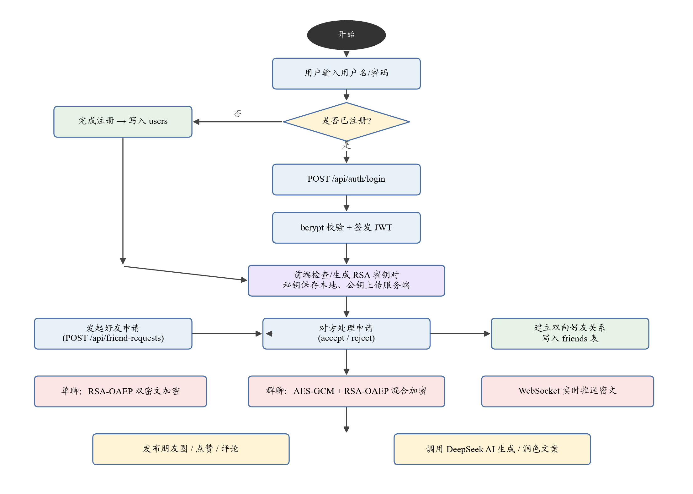

图 3-1 系统整体业务流程图

聊天加密发送流程是本系统的核心特色之一，它和传统“前端明文、服务端再处理”的模式有本质区别。在本系统中，无论是单聊还是群聊，明文消息只存在于发送方与接收方两端的浏览器内存中，服务端更像一个“密文邮局”。以单聊为例，用户输入消息并点击发送后，前端会先确认本地已有自己的 RSA 私钥；如果没有，就提示用户重新登录或重新生成密钥对。随后，系统从好友列表中读取目标好友的公钥与算法标识，对同一段明文分别生成发送方密文和接收方密文，再把这两份密文连同算法信息一起提交给服务端。服务端只负责参数校验、持久化以及 WebSocket 转发，不参与解密。发送方和接收方各自使用浏览器本地私钥解开属于自己的那一份密文，最后把明文显示在聊天窗口里。

群聊场景下流程更为复杂：发送者在前端为当前消息一次性生成 AES-GCM-256 会话密钥与随机 IV，用 AES 加密明文得到共享正文密文，再用每个群成员的 RSA 公钥分别包裹 AES 会话密钥得到多份仅属于不同成员的密钥密文，最后把这些内容一并提交给群聊消息发送接口。服务端校验通过后只保存一份正文密文与多份会话密钥密文，并通过 WebSocket 把“共享正文 + 当前接收者自己的那份密钥”分别推送给在线群成员；接收方在本地先用 RSA 私钥解密 AES 会话密钥，再用 AES 解密正文，得到最终明文。

### 3.3 系统功能需求分析

系统的用户角色按照“是否登录”与“是否对数据有所有权”两个维度划分，最终只保留一种登录后的核心角色——普通用户。本系统的目标场景是“个人社交语境下的端到端加密 IM 与轻量社交动态”，因此所有业务行为都围绕消息中心、朋友圈、通讯录和用户模块四个一级功能域展开。考虑到端到端加密的设计前提是“服务端不接触聊天明文”，本期没有引入可查看聊天明文的后台管理员角色，以避免系统目标与权限设计相互冲突。系统中所有用户在权限上彼此对等，仅在数据可见性上受到“是否为好友 / 是否为群成员 / 是否为本人”的细粒度限制。普通用户的完整用例集合如图 3-2 所示。

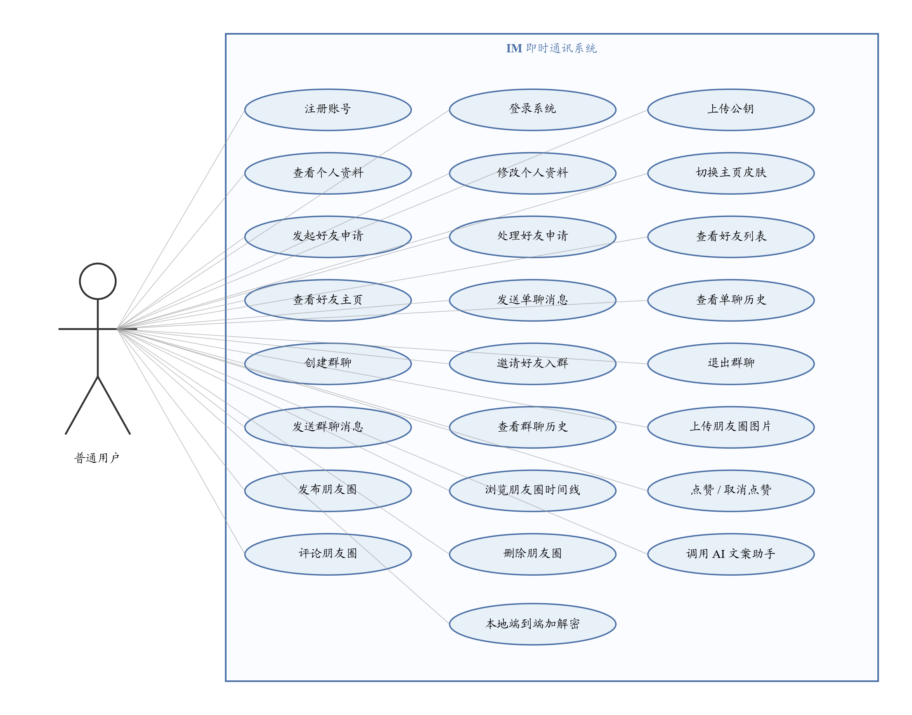

图 3-2 普通用户用例图

下面按照系统功能架构图中的四个一级模块逐一分析其功能需求，并对其中具有代表性的业务场景补充用例描述。

#### 3.3.1 消息中心模块

消息中心模块是用户进入系统后停留时间最长的区域。这里既承载人与人之间的实时沟通，也承担与 AI 助手对话、保存重要消息等延伸需求。

好友聊天建立在好友关系之上。用户进入会话后，系统需要能够拉取历史消息、接收实时推送，并在对方离线后保留消息供其下次登录查看。考虑到本课题强调聊天隐私，单聊内容在浏览器端完成加密，服务端只负责校验、存储和转发密文，不保存任何明文聊天内容。

AI 智能聊天则面向另一种使用场景。用户可以在独立会话页中向大模型提问，系统需要支持历史问答加载、连续对话显示和回复持久化。这部分不依赖好友关系，也不要求通过 WebSocket 广播，更接近受保护的请求—响应式问答流程。

消息收藏解决的是“重要内容如何保留”的问题。用户可以把单聊、群聊或 AI 聊天中的关键消息单独保存下来，之后在收藏页集中查看，也可以根据来源回到原始语境。这样一来，消息中心不只是即时通信入口，也具备了轻量的信息沉淀能力。消息中心相关功能的代表性用例如表 3-1 所示。

表 3-1 好友聊天用例描述表

| 项 | 内容 |
| --- | --- |
| 用例编号 | UC-Message-001 |
| 用例名称 | 发送好友聊天消息 |
| 参与者 | 普通用户（发送方、接收方） |
| 前置条件 | 双方已互为好友；双方公钥已上传；发送方已登录并建立 WebSocket 连接 |
| 触发事件 | 用户在聊天窗口输入消息并点击发送 |
| 主流程 | 1. 前端读取好友公钥与本地私钥状态 2. 前端对明文分别生成发送方密文与接收方密文 3. 前端调用 POST /api/messages 提交密文消息 4. 后端校验好友关系与算法合法性 5. 后端写入消息表并通过 WebSocket 向接收方推送 6. 双方前端各自使用本地私钥解密并显示消息 |
| 异常分支 | 非好友关系返回 403；本地私钥缺失时前端显示 `***（已加密）` |
| 后置条件 | 双方会话中新增一条聊天记录，服务端只保存密文 |

#### 3.3.2 朋友圈模块

朋友圈模块承担的是内容表达和关系互动的需求，它让系统从“能聊天”进一步发展到“能分享生活”。

用户登录后可以看到自己和好友发布的动态，时间线按照发布时间倒序展示，并且会同时呈现正文、图片、作者信息、点赞数和评论列表。这里最重要的约束是可见性边界：只有好友关系成立后，对应内容才会出现在时间线中。

在看到动态之后，用户还可以继续完成点赞、取消点赞和评论等互动操作。系统需要保证点赞不会重复写入，评论内容不能为空，而且只有当前用户本来就有权查看的动态，才允许继续互动。

如果用户希望围绕某一个好友集中浏览内容，就可以进入好友朋友圈主页。在这个页面里，好友的公开资料和其已发布的动态会一起展示出来，因此它既是内容页，也带有明显的个人主页属性。与此同时，用户也可以自己发布新的朋友圈内容，正文和图片共同组成一条动态，必要时还可以借助 AI 文案助手做生成或润色。朋友圈模块中最有代表性的业务场景是发布动态，其用例描述如表 3-2 所示。

表 3-2 发布朋友圈动态用例描述表

| 项 | 内容 |
| --- | --- |
| 用例编号 | UC-Moment-001 |
| 用例名称 | 发布朋友圈动态 |
| 参与者 | 普通用户 |
| 前置条件 | 用户已登录 |
| 触发事件 | 用户在朋友圈发布页填写正文与/或上传图片，并点击“发布”按钮 |
| 主流程 | 1. 用户上传图片并获得 objectKey 2. 用户填写正文，必要时调用 AI 文案助手生成或润色 3. 前端校验正文 trim 后不为空 4. 前端调用 POST /api/moments 提交正文与图片 Key 列表 5. 后端写入朋友圈动态并返回完整动态视图 6. 前端将新动态插入时间线顶部 |
| 异常分支 | 正文为空返回 400；图片类型非法返回 400；对象存储不可用时按降级方案处理 |
| 后置条件 | 当前用户的好友在后续时间线加载中可看到该动态 |

#### 3.3.3 通讯录模块

通讯录模块负责把用户之间的关系建立起来，并把已经建立的关系稳定维护下去。没有这一层，消息中心和朋友圈中的很多权限控制都无从谈起。

一方面，用户登录后需要看到已经建立关系的全部好友。好友列表除了展示昵称、头像、签名等基本信息外，还是进入聊天、好友主页和群聊邀请的主要入口；由于单聊加密依赖好友公钥，因此列表查询时还需要返回后续通信会用到的公钥信息。

另一方面，好友关系不能凭空生成，而要从好友申请开始。用户通过用户名发起申请后，对方可以在申请页中看到待处理记录，并选择同意或拒绝。系统在这里要处理好几条基本规则：不能添加自己，不能向已经是好友的用户重复申请，也不能反复提交尚未处理的申请。通讯录模块的代表性场景是发起好友申请，用例描述如表 3-3 所示。

表 3-3 发起好友申请用例描述表

| 项 | 内容 |
| --- | --- |
| 用例编号 | UC-Contact-001 |
| 用例名称 | 发起好友申请 |
| 参与者 | 普通用户 |
| 前置条件 | 用户已登录；目标用户已注册 |
| 触发事件 | 用户在通讯录或主界面点击“添加好友”并输入对方用户名 |
| 主流程 | 1. 前端校验用户名长度合法 2. 前端调用 POST /api/friend-requests 发送申请 3. 后端根据用户名查询目标用户 4. 校验不能加自己、当前不是好友且不存在 pending 申请 5. 写入好友申请记录 |
| 异常分支 | 自加自己 / 已是好友 / 已存在待处理申请时返回 400 |
| 后置条件 | 对方在好友申请页中看到一条新的待处理申请 |

#### 3.3.4 用户模块

用户模块负责解决“用户如何进入系统、如何被系统识别、又怎样把自己展示给别人看”这几个基础问题，因此它既是技术入口，也是体验入口。

用户首先要完成注册和登录。系统需要校验用户名与密码的基本合法性，并在登录成功后签发 JWT，以便后续受保护接口继续识别当前身份。在此基础上，系统还补充了修改密码能力：用户在安全页输入旧密码、新密码和确认新密码后，后端重新校验身份并更新密码哈希，修改成功后要求用户重新登录。

进入系统之后，用户还需要维护自己的公开资料。头像、昵称、签名这些信息既出现在个人页面，也会出现在好友视角下的主页中，所以系统必须处理好“哪些字段自己能改、哪些字段别人能看”这一边界。另一方面，个性装扮让用户主页不只是资料的堆叠，而是带有一定风格表达。用户可以选择预设皮肤和装饰项，系统再根据这些配置切换页面样式。用户模块的代表性场景是用户登录，用例描述如表 3-4 所示。

表 3-4 用户登录用例描述表

| 项 | 内容 |
| --- | --- |
| 用例编号 | UC-User-001 |
| 用例名称 | 用户登录 |
| 参与者 | 普通用户 |
| 前置条件 | 用户已完成注册 |
| 触发事件 | 用户在登录页输入用户名和密码并点击登录 |
| 主流程 | 1. 前端校验用户名与密码长度 2. 前端调用 POST /api/auth/login 3. 后端使用 bcrypt 校验密码哈希 4. 后端签发 JWT 并返回用户信息 5. 前端保存 Token 与当前用户状态并跳转到主页面 |
| 异常分支 | 用户名不存在或密码错误时返回 401 并提示 |
| 后置条件 | 用户进入登录态，可访问受保护接口 |

### 3.4 系统非功能需求分析

除上述功能需求外，系统还需要满足以下非功能需求以保障整体质量与用户体验。

**性能需求。** 前端首屏加载时间应在 3 秒以内；HTTP 接口平均响应时间在 500 毫秒以内；WebSocket 消息从发送到对端浏览器收到的端到端延迟在 1 秒以内（局域网环境下应在 200 毫秒以内）；朋友圈时间线接口在好友数小于 100、单用户动态数小于 1000 条的规模下响应时间在 1 秒以内。

**安全需求。** 系统的安全需求总体上以 OWASP Top 10:2021 中列出的常见 Web 应用风险作为防范基准[20]：全部受保护接口必须经过 JWT 身份验证以防范 A01 失效访问控制；用户密码必须使用 bcrypt 加盐哈希存储以防范 A02 加密失败；GORM 全部使用参数化绑定以防范 A03 注入；聊天消息明文不允许在服务端任何环节出现（包括日志、临时变量、数据库、缓存）；WebSocket 建连时必须校验 token；公钥真实性由"上传时用 JWT 关联用户身份"提供基础保证；图片上传严格校验 Content-Type 与文件大小；敏感配置（数据库密码、JWT Secret、DeepSeek API Key、MinIO Access Key）统一通过配置文件 / 环境变量管理，不写入代码仓库。

**可用性需求。** 当 DeepSeek 不可达时，AI 文案助手接口能够明确返回错误并在前端给出"AI 助手暂未配置或暂时不可用"的友好提示，不影响朋友圈的正常发布；当 MinIO 不可达时，图片上传降级为本地静态目录；当本地 RSA 私钥丢失时，聊天界面统一显示占位文案 `***（已加密）`，而不是抛出异常或向服务端请求明文。

**可维护性需求。** 后端代码分层清晰，分为 handler、service、repository、model 四层；前端代码按视图、组件、状态管理、API 封装、工具函数五个维度组织；接口命名遵循 RESTful 风格，资源名使用复数；数据库迁移通过 `init.sql` 脚本管理；代码风格通过 `gofmt`/`go vet`/`eslint`/`prettier` 自动检查。

**可扩展性需求。** 用户角色未来可以扩展出管理员角色而无需重构鉴权层；消息表设计支持后续扩展图片消息、文件消息、消息已读回执；群聊密钥分发架构支持未来引入会话密钥协商（如 X3DH）以获得前向保密能力。

---

## 4 系统设计

本章在第 3 章系统分析的基础上，从总体设计、数据库设计与详细设计三个层面对系统进行设计。总体设计部分给出系统的功能架构、业务架构与技术架构；数据库设计部分给出 E-R 图与全部数据表结构；详细设计部分逐一阐述各核心模块的类设计、关键接口与活动流程。

### 4.1 系统总体设计

#### 4.1.1 系统功能架构

根据第 3 章的功能需求分析，本系统按功能域划分为九个主要功能模块：用户认证模块、个人资料与个性装扮模块、好友主页模块、好友关系模块、单聊模块、群聊模块、朋友圈动态模块、朋友圈 AI 文案助手模块与图片上传模块。其中，用户认证模块是其他所有模块的前置依赖；好友关系模块是单聊、群聊、好友主页与朋友圈可见性的基础；单聊与群聊模块共同构成系统的实时聊天能力；朋友圈动态、AI 文案助手与图片上传共同构成系统的社交动态能力；个性装扮模块与好友主页模块共同构成系统的"个性化"特色。系统的整体功能架构如图 4-1 所示。

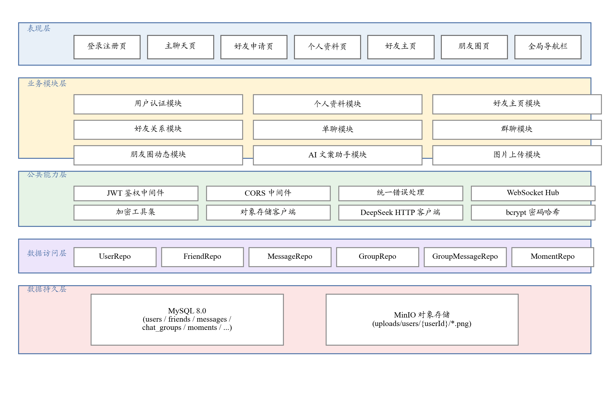

图 4-1 系统功能架构图

功能架构图自上而下分为五个层次：表现层呈现登录注册页、主聊天页、好友申请页、个人资料页、好友主页、朋友圈页与全局导航栏；业务模块层包含上述九个功能模块；公共能力层封装鉴权中间件、CORS 中间件、统一错误处理、WebSocket Hub、加密工具、对象存储客户端；数据访问层封装基于 GORM 的仓储接口；数据持久层使用 MySQL 保存结构化业务数据、MinIO 保存图片对象。

#### 4.1.2 系统业务架构

系统在业务架构上同样采用分层式设计。如图 4-2 所示，自顶向下分为四个层级：表现层（Presentation Layer）、业务应用层（Business Application Layer）、应用支撑层（Application Support Layer）与数据资源层（Data Resource Layer），并配套安全保障体系与规范体系。

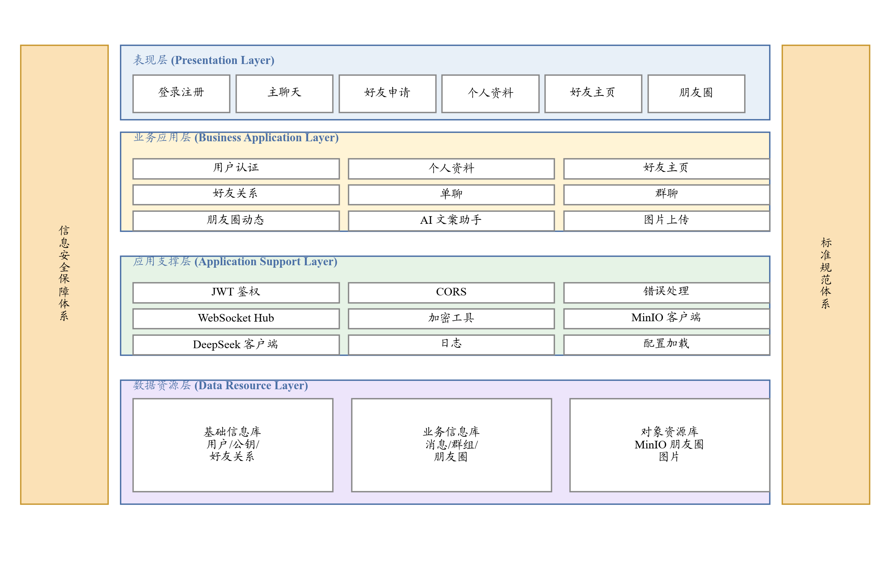

图 4-2 系统业务架构图

表现层为用户提供可直接交互的 Web 端入口，支持 PC 浏览器访问，主要呈现登录注册、主聊天、好友申请、个人资料、好友主页、朋友圈等核心页面；业务应用层提供核心业务功能，包括用户认证、个人资料、好友主页、好友关系、单聊、群聊、朋友圈动态、朋友圈 AI 助手与图片上传九大模块；应用支撑层为业务应用提供基础技术支撑，包括 JWT 鉴权、CORS、统一错误处理、WebSocket Hub 连接管理、加密工具集、MinIO 对象存储客户端、DeepSeek HTTP 客户端等；数据资源层提供数据存储与管理支撑，包括 MySQL 关系型数据库（用户、好友、消息、群组、朋友圈等业务数据）与 MinIO 对象存储（图片）。

#### 4.1.3 系统技术架构

系统技术架构如图 4-3 所示，整体采用经典的"前后端分离 + RESTful + WebSocket"混合架构，自顶向下划分为前端展示层、网络通信层、后端服务层、数据持久层与外部服务层五个层级，各层之间通过清晰的接口契约解耦。

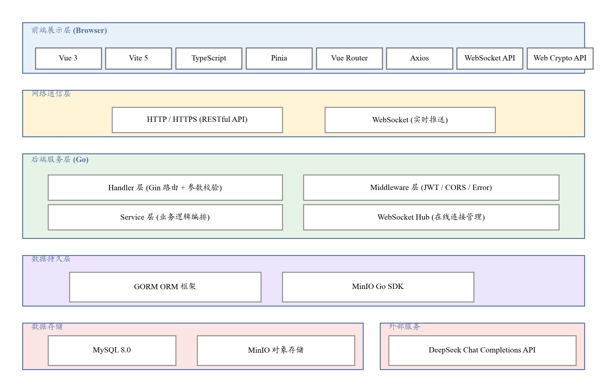

图 4-3 系统技术架构图

前端展示层基于 Vue 3 + Vite + TypeScript 构建，通过 Pinia 管理全局状态、Vue Router 控制页面路由、Axios 封装 HTTP 调用、浏览器原生 WebSocket API 与服务端建立长连接、Web Crypto API 完成端到端加解密。

网络通信层包含 HTTP/HTTPS 与 WebSocket 两种协议：HTTP/RESTful 接口承担注册登录、资料维护、好友申请、好友列表、历史消息、朋友圈发布与查询、图片上传、AI 文案助手等常规业务；WebSocket 长连接专注于聊天消息的实时双向推送。

后端服务层基于 Go + Gin 构建，按"handler → service → repository → model"四层分层组织代码，handler 层只负责参数校验与响应封装，service 层负责业务逻辑编排，repository 层基于 GORM 完成数据访问，model 层定义实体与数据库映射。后端额外维护一个 WebSocket Hub，按 `userID -> *websocket.Conn` 维护在线连接，并在消息到达时按接收方/群成员路由分发。

数据持久层使用 MySQL 8 保存用户、好友、消息、群组、朋友圈、点赞、评论等结构化数据，使用 MinIO（兼容 S3）保存朋友圈图片对象。

外部服务层依赖 DeepSeek Chat Completions API 提供 AI 文案能力，API Key 仅保存在后端配置文件中，所有调用通过后端代理，前端不直接接触模型 API。

#### 4.1.4 模块的设计

本节通过活动图描述系统关键流程的执行顺序与分支。受篇幅所限，本节给出"用户登录"、"单聊消息发送"与"群聊消息发送"三个最具代表性的活动图。

**用户登录活动图。** 用户在登录页输入用户名、密码并点击登录后，前端首先校验长度合法性，然后调用登录接口；服务端进入 `AuthService.Login` 方法：先按 `username` 在 `users` 表中查询用户，若不存在则返回 401；若存在则使用 `bcrypt.CompareHashAndPassword` 校验密码，若不匹配则返回 401；若匹配则用 `jwt.SignedString` 生成 7 天有效期的 Token，并返回用户基础信息。前端拿到响应后将 Token 与用户信息分别保存到 `localStorage` 与 Pinia store，最后跳转到主聊天页。如图 4-4 所示，为用户登录活动图。

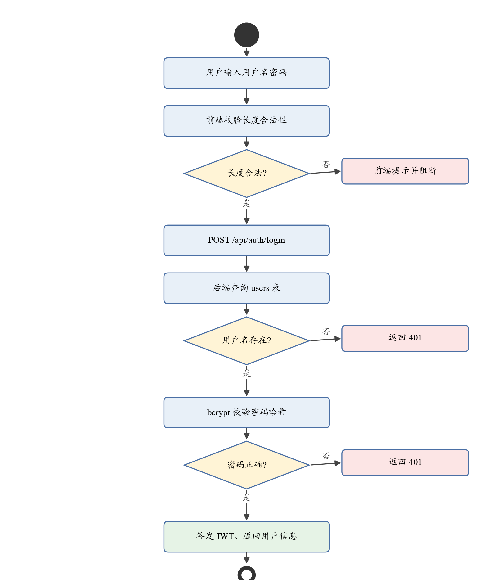

图 4-4 用户登录活动图

**单聊消息发送活动图。** 用户在聊天窗口输入明文后点击发送，前端进入加密发送流程：首先从本地 `localStorage` 加载自己的 RSA 私钥，从好友列表中读取目标好友公钥；随后分别生成发送方密文和接收方密文，再把这两份密文提交给单聊消息发送接口。服务端 `MessageService.Create` 校验好友关系和算法标识后，通过 `MessageRepo.Insert` 写入数据库，再通过 Hub.Broadcast 找到接收方在线连接并下发消息。接收方收到 WebSocket 消息后从本地 `localStorage` 加载自己的 RSA 私钥并解密属于自己的那份密文，最后把明文渲染到聊天窗口。如图 4-5 所示。

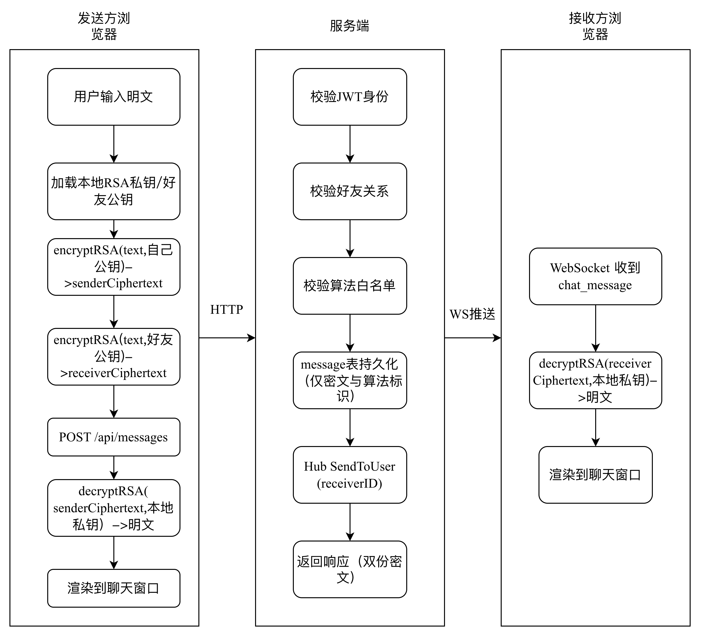

图 4-5 单聊消息发送活动图

**群聊消息发送活动图。** 用户在群聊窗口输入明文后点击发送，前端会先确认本地已经拿到所有群成员的公钥，然后生成一次性的 AES-GCM 会话密钥与随机 IV，用它先把正文加密成共享密文；接下来再遍历群成员公钥，把同一个 AES 会话密钥分别包裹成多份只属于不同成员的密钥密文，最后一并提交给服务端。服务端在校验发送者身份、成员覆盖范围和算法合法性之后，把共享正文密文与各成员对应的密钥密文分别写入数据库，并通过 WebSocket 按成员分发出去。接收方拿到消息后，先用自己的 RSA 私钥解开那一份属于自己的会话密钥，再用它去解正文密文，最终得到明文。如图 4-6 所示。

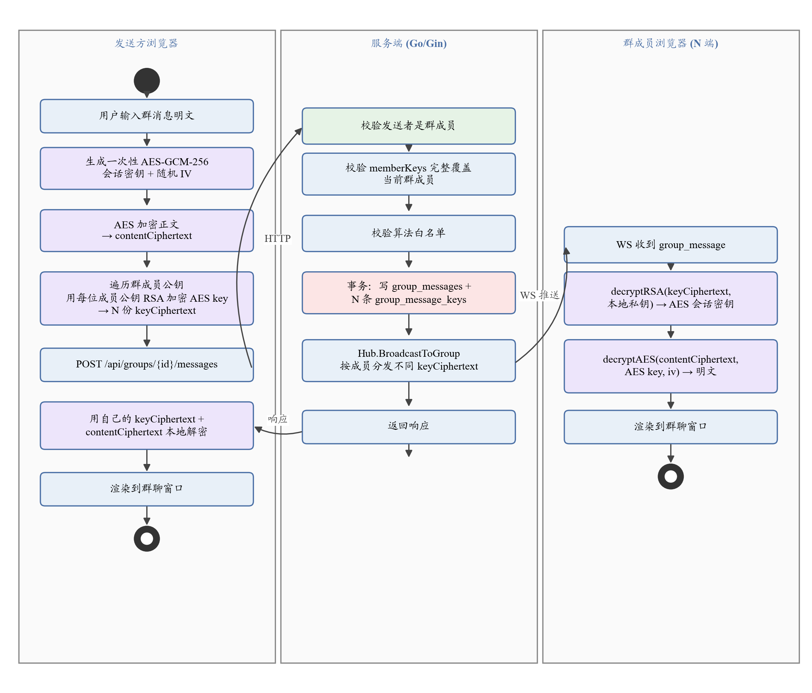

图 4-6 群聊消息发送活动图

### 4.2 系统数据库设计

数据库设计是系统设计的关键环节。本系统的全部业务数据均存储在 MySQL 8 中，包含 11 张数据表：`users`、`friend_requests`、`friends`、`messages`、`chat_groups`、`group_members`、`group_messages`、`group_message_keys`、`moments`、`moment_likes`、`moment_comments`；图片对象数据存储在 MinIO 中。下面先给出 E-R 图，再逐表给出结构定义。

#### 4.2.1 数据模型图（E-R 图）

通过对系统功能需求与业务流程的分析，可以抽象出以下核心实体：用户（User）、好友申请（FriendRequest）、好友关系（Friend）、消息（Message）、群组（ChatGroup）、群成员（GroupMember）、群消息（GroupMessage）、群消息会话密钥（GroupMessageKey）、朋友圈动态（Moment）、朋友圈点赞（MomentLike）、朋友圈评论（MomentComment）。各实体间关系如图 4-7 所示。

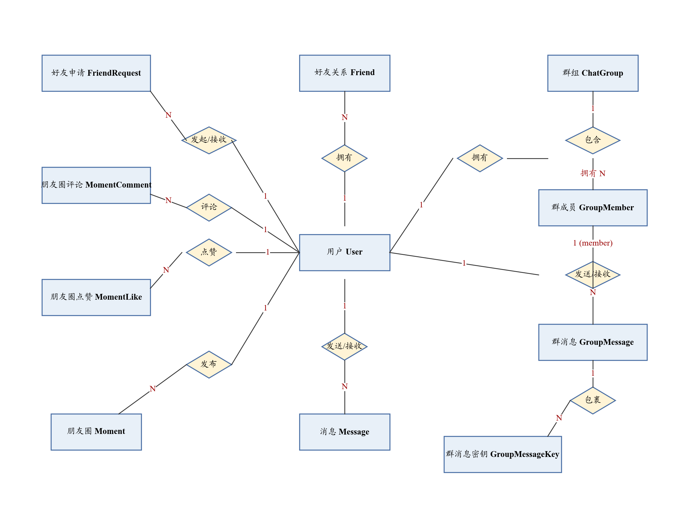

图 4-7 系统 E-R 设计图

各实体之间的关系如下：一个用户可以发送多条好友申请、接收多条好友申请、拥有多条好友关系记录、发送多条消息、接收多条消息、创建多个群组、加入多个群组、发布多条朋友圈、对多条朋友圈点赞与评论；一条好友申请只关联一个申请人与一个接收人，关系为多对一；一个群组拥有多个群成员，关系为一对多；一条群消息对应多个群消息会话密钥（一个成员一份），关系为一对多；一条朋友圈动态可被多个用户点赞并接收多条评论，关系均为一对多。

#### 4.2.2 表结构设计

根据 E-R 图，可以将概念模型转换为 MySQL 物理表结构。下面逐表给出表结构定义。

`users` 用户表是系统的核心表，是其他大多数表的外键引用对象，如表 4-1 所示。

表 4-1 users（用户信息表）

| 字段名 | 类型 | 说明 |
| --- | --- | --- |
| id | BIGINT UNSIGNED | 主键，自增 |
| username | VARCHAR(50) | 用户名，唯一 |
| password_hash | VARCHAR(255) | bcrypt 加盐哈希后的密码 |
| nickname | VARCHAR(50) | 昵称 |
| avatar | VARCHAR(255) | 系统默认头像 URL，不允许用户修改 |
| gender | TINYINT | 性别：0-未知，1-男，2-女 |
| signature | VARCHAR(255) | 个性签名 |
| homepage_skin | VARCHAR(50) | 主页皮肤标识，默认 aurora |
| public_key | TEXT | 用户 RSA 公钥（SPKI Base64） |
| public_key_algorithm | VARCHAR(50) | 公钥算法标识，如 rsa-oaep-sha256 |

`friend_requests` 表通过 `from_user_id` 与 `to_user_id` 两个外键关联到 `users` 表，`status` 字段标识申请处于 pending/accepted/rejected 三种状态之一，如表 4-2 所示。

表 4-2 friend_requests（好友申请表）

| 字段名 | 类型 | 说明 |
| --- | --- | --- |
| id | BIGINT UNSIGNED | 主键 |
| from_user_id | BIGINT UNSIGNED | 申请人 ID |
| to_user_id | BIGINT UNSIGNED | 接收人 ID |
| message | VARCHAR(255) | 申请附言 |
| status | VARCHAR(20) | pending / accepted / rejected |

`friends` 表采用"双向两条记录"的方式存储好友关系，(user_id, friend_id) 上有唯一索引，避免重复记录，同时查询某用户的好友列表时无需 UNION，直接 `WHERE user_id = ?` 即可，如表 4-3 所示。

表 4-3 friends（好友关系表）

| 字段名 | 类型 | 说明 |
| --- | --- | --- |
| id | BIGINT UNSIGNED | 主键 |
| user_id | BIGINT UNSIGNED | 用户 ID |
| friend_id | BIGINT UNSIGNED | 好友 ID（与 user_id 联合唯一） |

`messages` 表保存单聊消息的双份密文，分别使用 `sender_ciphertext` 与 `receiver_ciphertext` 字段，并各自带一个算法标识。该表在 `(sender_id, receiver_id, created_at)` 与 `(receiver_id, sender_id, created_at)` 两个组合索引上建立覆盖索引，以支撑双向历史消息查询，如表 4-4 所示。

表 4-4 messages（聊天消息表）

| 字段名 | 类型 | 说明 |
| --- | --- | --- |
| id | BIGINT UNSIGNED | 主键 |
| sender_id | BIGINT UNSIGNED | 发送者 ID |
| receiver_id | BIGINT UNSIGNED | 接收者 ID |
| sender_ciphertext | TEXT | 发送方可解密密文 |
| sender_algorithm | VARCHAR(50) | 发送方密文算法 |
| receiver_ciphertext | TEXT | 接收方可解密密文 |
| receiver_algorithm | VARCHAR(50) | 接收方密文算法 |
| created_at | DATETIME | 发送时间 |

`chat_groups` 表保存群组的基础信息，如表 4-5 所示。

表 4-5 chat_groups（群组表）

| 字段名 | 类型 | 说明 |
| --- | --- | --- |
| id | BIGINT UNSIGNED | 主键 |
| name | VARCHAR(50) | 群名称 |
| owner_id | BIGINT UNSIGNED | 创建者 ID |
| created_at | DATETIME | 创建时间 |

`group_members` 表存储群成员关系，`(group_id, user_id)` 上有唯一约束以保证同一用户在同一群中只有一条记录，如表 4-6 所示。

表 4-6 group_members（群成员表）

| 字段名 | 类型 | 说明 |
| --- | --- | --- |
| id | BIGINT UNSIGNED | 主键 |
| group_id | BIGINT UNSIGNED | 群 ID |
| user_id | BIGINT UNSIGNED | 成员 ID |
| joined_at | DATETIME | 入群时间 |

`group_messages` 表保存群聊正文的共享密文与 AES-GCM IV，如表 4-7 所示。

表 4-7 group_messages（群消息正文表）

| 字段名 | 类型 | 说明 |
| --- | --- | --- |
| id | BIGINT UNSIGNED | 主键 |
| group_id | BIGINT UNSIGNED | 群 ID |
| sender_id | BIGINT UNSIGNED | 发送者 ID |
| content_ciphertext | TEXT | AES-GCM 加密后的群消息正文密文 |
| content_iv | VARCHAR(64) | AES-GCM 随机 IV |
| content_algorithm | VARCHAR(50) | 正文加密算法，当前为 aes-gcm-256 |
| created_at | DATETIME | 发送时间 |

`group_message_keys` 表是群聊端到端加密的关键设计：每条群消息会按群成员数量拆分多份 keyCiphertext，每位成员只解开属于自己的那一份，如表 4-8 所示。

表 4-8 group_message_keys（群消息会话密钥表）

| 字段名 | 类型 | 说明 |
| --- | --- | --- |
| id | BIGINT UNSIGNED | 主键 |
| message_id | BIGINT UNSIGNED | 对应的群消息 ID |
| user_id | BIGINT UNSIGNED | 该密钥密文对应的成员 ID |
| key_ciphertext | TEXT | RSA-OAEP 加密的 AES 会话密钥 |
| key_algorithm | VARCHAR(50) | 密钥包裹算法，当前为 rsa-oaep-sha256 |

`moments` 表保存朋友圈动态的正文与图片 objectKey 列表（JSON 字符串），如表 4-9 所示。

表 4-9 moments（朋友圈动态表）

| 字段名 | 类型 | 说明 |
| --- | --- | --- |
| id | BIGINT UNSIGNED | 主键 |
| user_id | BIGINT UNSIGNED | 发布者 ID |
| content | TEXT | 朋友圈正文 |
| images_json | TEXT | 图片 objectKey 列表 JSON |
| created_at | DATETIME | 创建时间 |

`moment_likes` 表通过 `(moment_id, user_id)` 唯一索引保证同一用户对同一动态最多一条点赞记录，如表 4-10 所示。

表 4-10 moment_likes（朋友圈点赞表）

| 字段名 | 类型 | 说明 |
| --- | --- | --- |
| id | BIGINT UNSIGNED | 主键 |
| moment_id | BIGINT UNSIGNED | 朋友圈动态 ID |
| user_id | BIGINT UNSIGNED | 点赞用户 ID |
| created_at | DATETIME | 点赞时间 |

`moment_comments` 表存储朋友圈评论，按时间正序展示，如表 4-11 所示。

表 4-11 moment_comments（朋友圈评论表）

| 字段名 | 类型 | 说明 |
| --- | --- | --- |
| id | BIGINT UNSIGNED | 主键 |
| moment_id | BIGINT UNSIGNED | 朋友圈动态 ID |
| user_id | BIGINT UNSIGNED | 评论用户 ID |
| content | TEXT | 评论内容 |
| created_at | DATETIME | 评论时间 |

### 4.3 系统详细设计

本节不再按后端分层去拆解，而是顺着用户真正接触到的四个一级模块来写：消息中心、朋友圈、通讯录和用户模块。这样的写法更贴近系统功能架构图，也更容易和后面的界面实现部分对应起来。

#### 4.3.1 消息中心

消息中心是系统里最活跃的部分。用户进入系统后，大多数时间都会停留在这里：和好友聊天、和 AI 对话，或者把重要消息收起来以后再看。为了支撑这种高频使用场景，这个模块整体采用了“历史记录通过 HTTP 拉取，实时消息通过 WebSocket 推送，前端负责把两部分状态合并”的方式。

好友聊天围绕已经建立好友关系的用户展开。前端在切换会话时先拉取历史消息，随后保持 WebSocket 长连接接收实时推送；后端在消息入库前会先确认双方是否互为好友，再校验加密算法是否合法，最后才完成持久化和推送。因为本课题把聊天隐私放在很重要的位置，所以单聊消息在浏览器端完成加密，服务端从头到尾只处理密文。接收方拿到消息后，依靠本地私钥解密属于自己的那一份内容。如果本地私钥不存在，界面会给出占位文本，而不是让整个会话异常中断。

AI 智能聊天虽然也放在消息中心里，但它的运行方式和好友聊天并不一样。它没有好友关系约束，也不需要广播给其他在线用户，而是更像一个受保护的问答接口：前端提交问题，后端带着上下文去调用 DeepSeek，再把回复返回并保存下来。用户再次进入 AI 会话页时，可以继续看到之前的问答内容，这样对话就不是一次性的，而是连续的。

消息收藏是消息中心里另一个很实用的补充能力。用户在单聊、群聊或 AI 对话中看到值得保留的内容时，可以直接收藏。前端把消息标识和来源信息提交给后端，后端确认这些消息本来就属于当前用户可见范围之后，再把收藏关系存下来。这样做的结果是，消息中心不只是“说完就过去”的地方，也能承担一定的信息沉淀作用。

#### 4.3.2 朋友圈

朋友圈模块把系统从“能聊天”扩展到了“能分享内容”。用户在这里发布动态、浏览好友近况、点赞评论，也会顺着动态进入某个好友的个人主页，所以它天然带有更强的社交属性。

时间线页面是朋友圈最常用的入口。后端会先根据当前用户的好友关系确定可见范围，再把“自己和好友”的动态按时间倒序返回；前端拿到结果后，把正文、图片、作者信息、点赞数和评论区组织成卡片流展示出来。这里最关键的设计点不是页面排版，而是可见性边界——谁能看到什么，必须由好友关系来约束。

在浏览的基础上，用户还会继续互动。点赞和取消点赞属于很轻的动作，因此后端通过唯一索引来保证幂等性；评论则带有更强的内容属性，除了可见性校验，还要求评论内容不能为空。这样一来，动态卡片既是信息展示单元，也是互动入口。

好友朋友圈主页可以看作时间线的一种延伸。用户从聊天页、好友列表或者朋友圈作者区域点进去时，前端会同时请求公开资料和该好友的动态列表。页面上既有人的资料，也有这个人发过的内容，所以它把“社交关系”和“内容沉淀”放在了一个视图里。

发布动态则是朋友圈模块的起点。用户先上传图片，再输入正文；如果一时不知道怎么写，还可以调用 AI 助手帮忙生成或润色。等到正文和图片都准备好后，前端统一提交给发布接口，后端完成校验和持久化。和消息中心不同，这里处理的是“一对多”的公开分享内容，因此正文和图片采用明文存储，再通过好友关系来控制可见范围，而不是采用聊天里的端到端加密方案。

#### 4.3.3 通讯录

通讯录模块看起来不像消息中心那样热闹，但它实际上决定了整套系统里的社交关系是怎么建立起来的。没有通讯录，后面的聊天、朋友圈可见性、好友主页访问都缺少基础。

好友列表是通讯录里最稳定的一部分。后端把已经建立关系的好友信息查出来，连同昵称、头像、签名、公钥等内容一起返回；前端则把这些数据组织成联系人列表。这个列表不只是为了展示谁是好友，它还是进入聊天、查看好友主页、发起群聊邀请的入口。尤其是在端到端加密单聊场景里，好友列表还承担了公钥分发入口的角色。

好友申请则是整个关系链的起点。用户输入对方用户名发起申请后，后端要先确认目标用户存在，再依次检查是否在加自己、是否已经是好友、是否还有未处理的同向申请。接收方进入好友申请页后，可以决定同意还是拒绝；如果同意，系统会在事务里同时更新申请状态并写入双向好友关系。这样设计的好处是，关系建立过程是清晰可追踪的，不会出现没有确认就被直接加入好友列表的情况。

#### 4.3.4 用户模块

用户模块解决的是最基础、但也最绕不开的问题：用户怎样进入系统，系统怎样确认这个人是谁，以及这个人要以什么样的形象出现在别人面前。

登录、注册和修改密码构成了这里最核心的一条链路。注册时，前端收集用户名、密码和确认密码，后端再完成合法性校验和 bcrypt 哈希写入；登录时，后端核对密码哈希并签发 JWT，前端把登录态保存到 `localStorage` 和 Pinia 中。修改密码是在登录之后发生的安全操作，前端把旧密码、新密码和确认新密码提交给后端，后端确认无误后更新密码哈希，并要求用户重新登录。这样做既保证了账号入口的完整性，也把安全页纳入了统一的认证链路。

我的名片承担的是个人信息展示功能。用户进入个人空间时，可以看到并编辑头像、昵称、签名等内容；好友访问主页时，后端只返回经过裁剪后的公开字段。换句话说，同一份用户资料既服务于“自己编辑”，也服务于“别人认识我”，只是两种视角下的数据边界不同。

个性装扮则进一步补足了表达层面的需求。系统没有把主页做成完全固定的模板，而是提供了皮肤、装饰项和布局配置，让用户可以在统一风格范围内做个性化选择。前端负责根据这些配置切换页面样式，后端负责校验并保存配置值。于是，用户模块虽然不直接生产聊天内容或朋友圈内容，却决定了整个系统最初的入口感受和最终的个人展示效果。

---

## 5 系统实现

本章不再按技术分层去写，而是直接顺着系统功能架构图中的四个一级模块展开：消息中心、朋友圈、通讯录和用户模块。这样既更贴近真实使用流程，也便于把运行界面截图和具体功能一一对应起来。

### 5.1 消息中心模块实现

消息中心对应的是用户登录后的主活动区域。这里既有和好友的即时沟通，也有和 AI 助手的问答，还包括把重要内容单独保存下来的消息收藏功能。

#### 5.1.1 好友聊天实现

好友聊天是消息中心里最核心的一部分。前端在主聊天页加载好友列表后，用户点开任意联系人就能进入对应会话。页面先通过历史消息接口把已有聊天记录取回来，然后保持 WebSocket 长连接，用来接收对方实时发来的新消息。后端在处理发送请求时，会先确认双方确实已经互为好友，再校验消息里的加密算法字段，确认无误后才入库并推送。

这一部分实现里最关键的是端到端加密。用户登录后，前端会先检查浏览器本地有没有当前账号对应的 RSA 密钥对；如果没有，就现场生成，并把公钥上传到服务端。发送消息时，浏览器分别用发送方公钥和接收方公钥对同一段明文加密，形成双份密文；接收消息时，客户端只解密属于自己的那一份。这样设计之后，服务端在存储和转发过程中始终接触不到明文。好友聊天相关界面如图 5-1 和图 5-2 所示。

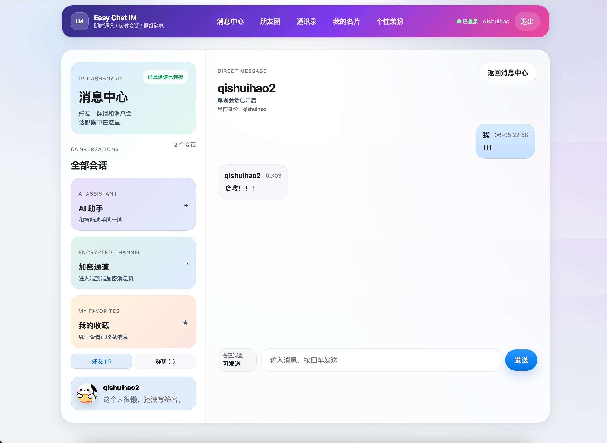

图 5-1 正常聊天运行界面图

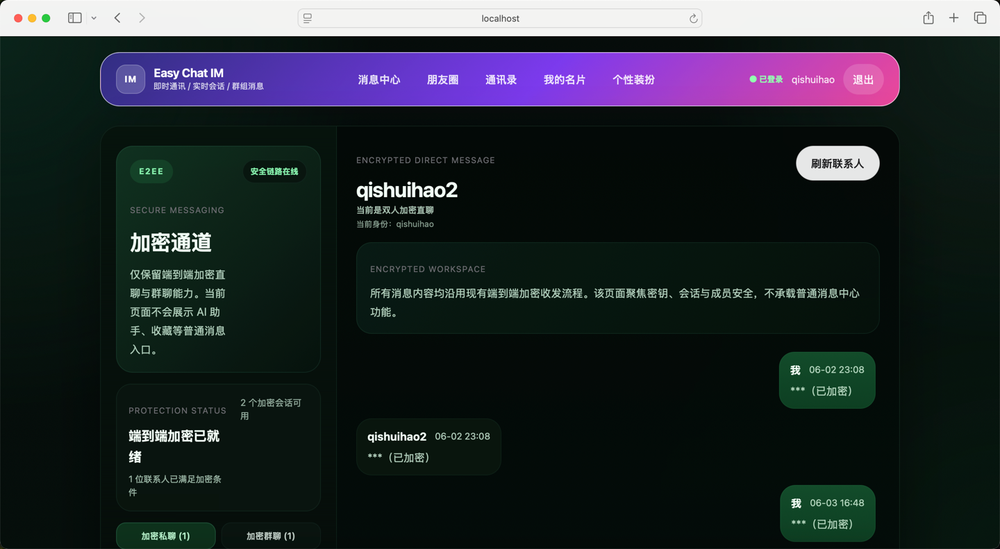

图 5-2 加密聊天运行界面图

#### 5.1.2 AI 智能聊天实现

AI 智能聊天给消息中心增加了另一种交流对象。前端在独立 AI 聊天页中维护输入框、消息列表和发送状态，用户把问题提交出去以后，请求会经由受保护接口到达后端；后端把当前提问和必要上下文整理成 DeepSeek Chat Completions 请求体，再把模型回复写回数据库并返回给前端。为了让对话看起来是连续的，页面每次打开时都会先加载历史问答，新的提问和回复则直接追加到原有列表后面。这样做之后，AI 对话在体验上会更接近即时通讯。AI 智能聊天界面如图 5-3 所示。

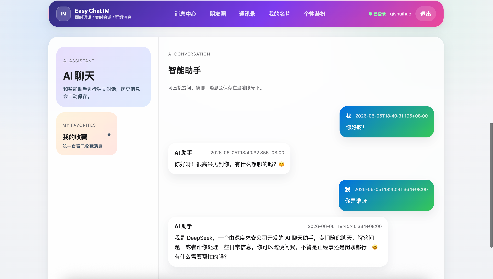

图 5-3 AI 智能聊天运行界面图

#### 5.1.3 消息收藏实现

消息收藏解决的是“重要内容不能被聊天流冲走”的问题。前端在聊天界面里提供单条收藏或多选收藏入口，用户把需要保留的消息选出来以后，系统会把消息标识、来源类型以及必要的上下文信息提交给后端；后端确认这些内容原本就属于当前用户可见范围后，再把收藏关系写入数据库。收藏页会把这些消息单独列出来，用户以后想回看时，不需要再翻很长的聊天记录。取消收藏时，也只是删除收藏关系，不会影响原始消息本身。消息收藏的运行界面如图 5-4 所示。

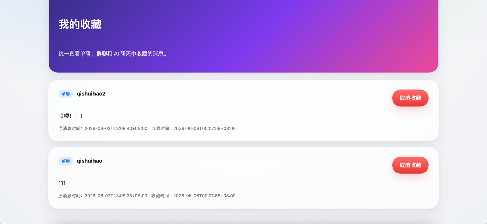

图 5-4 消息收藏运行界面图

### 5.2 朋友圈模块实现

朋友圈模块对应的是系统里的内容分享场景。它和消息中心不同，不是围绕即时对话展开，而是围绕“发动态、看动态、和别人互动”这一套社交行为来组织。

#### 5.2.1 朋友圈浏览与互动实现

朋友圈时间线页在前端以卡片流的方式展示当前用户自己以及好友可见的动态。页面加载时，前端会调用获取朋友圈列表的接口拉取数据；后端根据当前用户的好友关系确定可见范围，再按发布时间倒序查询动态，并把点赞数、评论列表以及“当前用户是否已点赞”等信息一起返回。前端拿到结果后，再把图片、正文、发布时间以及互动区域拼成完整卡片。

点赞和评论都建立在这条时间线上。点赞和取消点赞分别通过对应的互动接口完成，后端依靠唯一索引保证不会重复写入；评论则通过评论提交接口完成，后端在确认动态可见、评论内容合法之后再保存。这样一来，用户在浏览过程中就能顺手完成互动，而不用跳转到别的页面。朋友圈浏览与互动界面如图 5-5 所示。

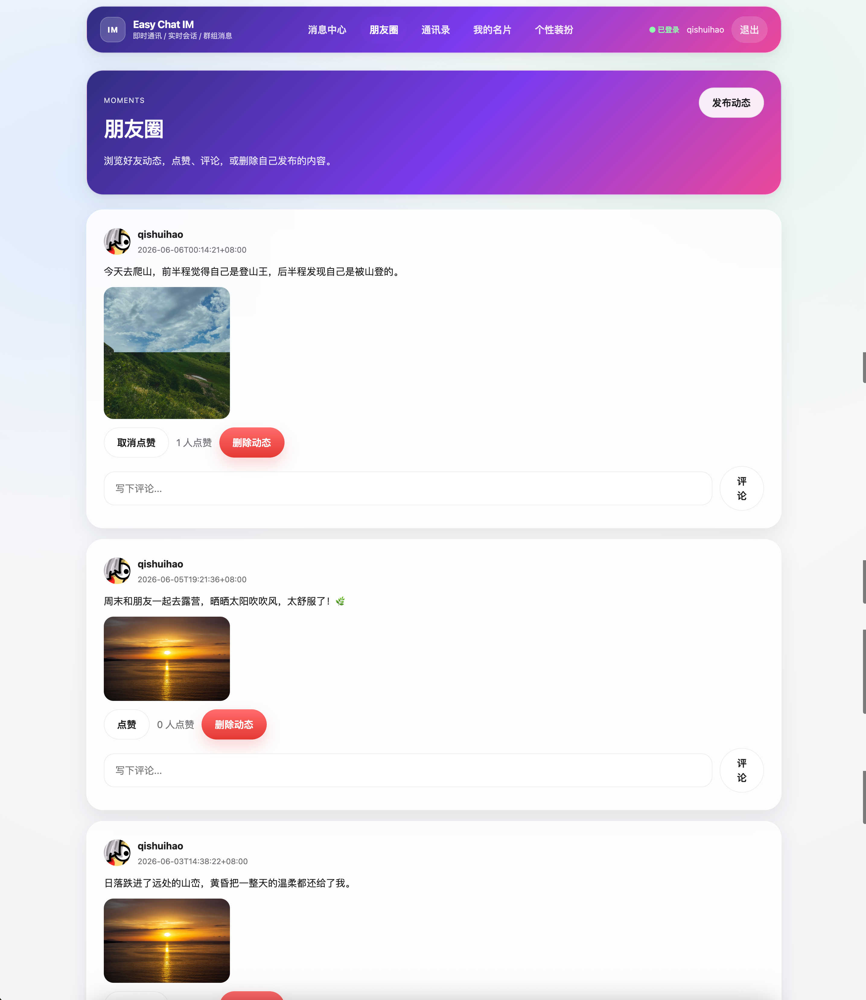

图 5-5 朋友圈浏览与互动运行界面图

#### 5.2.2 好友朋友圈主页实现

好友朋友圈主页把“看人”和“看内容”放到了同一个页面里。用户可以从好友列表、聊天窗口或者朋友圈作者入口进入这个页面；前端进入后会同时请求好友公开资料和该好友的动态列表。后端在返回结果前，会先确认访问者和目标用户之间确实存在好友关系，避免陌生人越权访问。页面渲染完成后，用户看到的就不只是一个人的名片，而是这个人的资料和动态内容被放在了一起。

#### 5.2.3 朋友圈发布实现

朋友圈发布页支持正文输入、图片上传和 AI 文案辅助。用户选中图片后，前端先通过图片上传接口把文件发给后端，后端依据当前配置决定把图片保存到 MinIO 还是本地静态目录，并把对象标识与访问地址返回回来。接着，用户可以直接写正文，也可以调用 AI 助手做生成或润色。等内容准备好之后，前端再把正文和图片标识列表一起提交给动态发布接口，由后端校验并写入数据库。朋友圈发布页的运行界面如图 5-6 所示。

发布朋友圈.png)

图 5-6 朋友圈发布运行界面图

### 5.3 通讯录模块实现

通讯录模块负责把用户之间的关系真正组织起来。它不像消息中心那样直接产生内容，但后面的聊天、朋友圈可见性和好友主页访问，都要建立在这里形成的关系基础上。

#### 5.3.1 好友列表实现

好友列表页通过好友列表查询接口加载当前用户的全部好友。后端在查询时联表返回好友的 ID、昵称、头像、签名、公钥以及公钥算法标识，前端再把这些信息渲染成联系人列表。由于端到端加密单聊需要读取好友公钥，因此好友列表不仅是联系人展示页，也是后续消息加密前的重要数据来源。用户可以从这里直接进入聊天窗口、查看好友名片，或者在创建群聊时把好友加入候选成员集合。好友列表运行界面如图 5-7 所示。

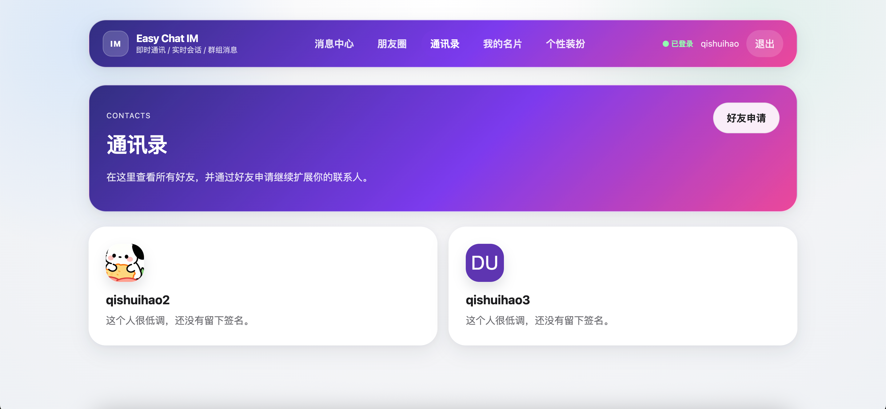

图 5-7 好友列表运行界面图

#### 5.3.2 好友申请实现

好友申请页对应的是关系建立的起点。前端在添加好友时输入目标用户名并提交申请；后端查询目标用户后，会依次检查是不是在加自己、是不是已经是好友、是不是还有待处理申请。只有这些条件都通过，申请才会真正写入数据库。接收方进入好友申请页后，可以决定同意还是拒绝；如果同意，后端会在事务里同时更新申请状态并写入双向好友关系；如果拒绝，则只修改申请状态。这样做既保留了处理痕迹，也让好友关系的建立过程足够清晰。好友申请界面如图 5-8 所示。

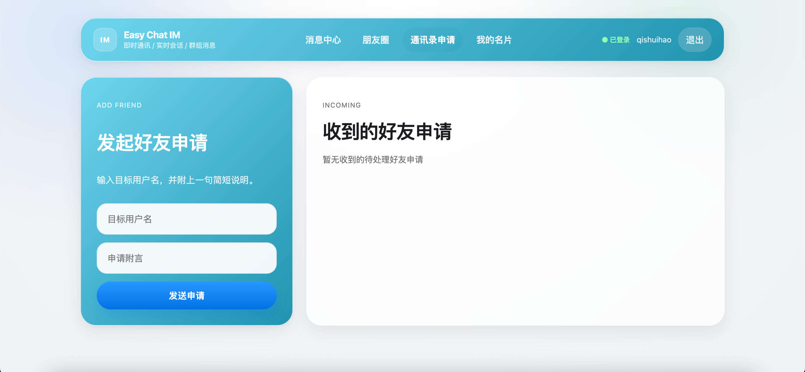

图 5-8 好友申请运行界面图

### 5.4 用户模块实现

用户模块对应的是系统最基础的入口层。用户先在这里完成注册和登录，之后再维护自己的资料、修改密码、调整主页外观，所以它既决定了系统怎么识别用户，也决定了用户最后以什么样子被别人看到。

#### 5.4.1 认证与授权实现（登录注册、修改密码）

登录与注册页是用户进入系统时最先接触到的两个页面。注册页要求输入用户名、密码和确认密码，前端先做长度校验，后端再完成用户名唯一性校验和 bcrypt 哈希写入；登录页则在前端提交用户名和密码之后，由后端校验哈希并签发 JWT，前端把 token 保存到 `localStorage`，同时写入 Pinia store，用来维持整个 Web 端的登录态。登录与注册界面分别如图 5-8 和图 5-9 所示。

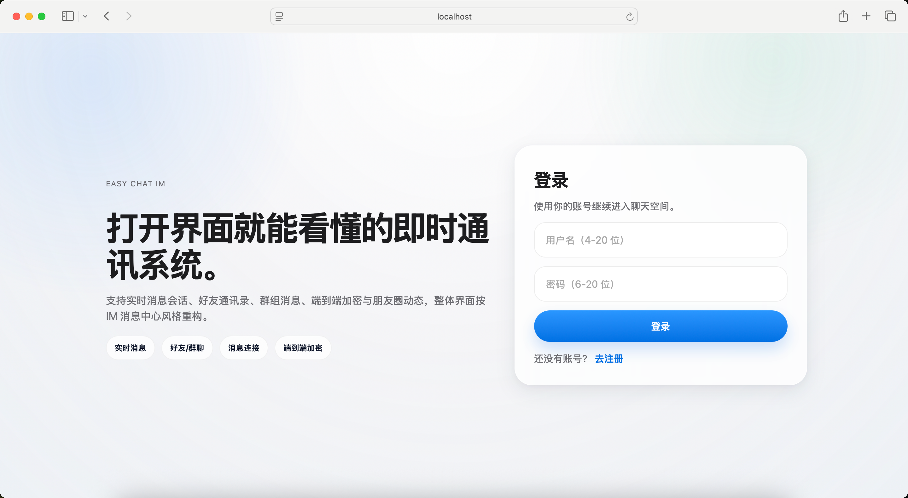

图 5-8 登录界面运行图

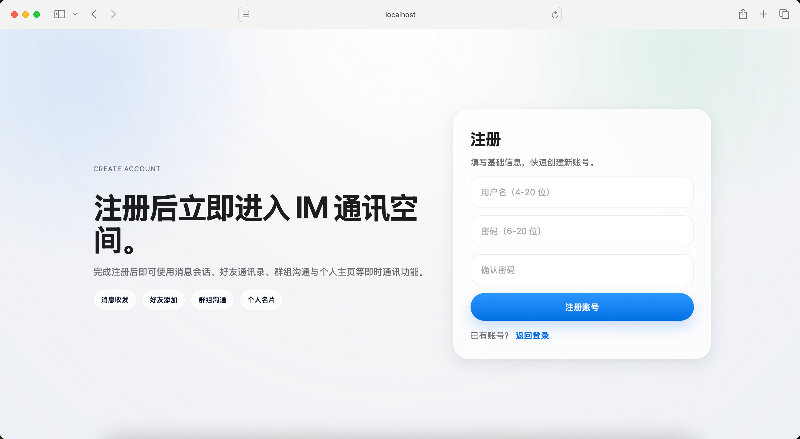

图 5-9 注册页面运行图

除了登录和注册，系统还补上了修改密码这一条安全链路。前端在独立账号安全页中提供旧密码、新密码和确认新密码三个输入框，数据提交到修改当前用户密码的接口；后端根据当前登录态找到用户后，再去校验旧密码是否正确、新密码长度是否合规以及新旧密码是否相同，最后重新生成 bcrypt 哈希并更新数据库。修改成功后，前端会清空当前 token 并跳转回登录页，要求用户使用新密码重新登录。修改密码界面如图 5-10 所示。

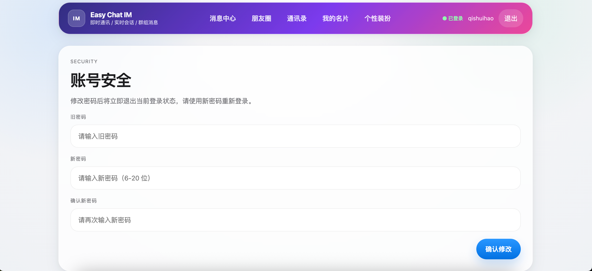

图 5-10 修改密码运行界面图

#### 5.4.2 我的名片实现

“我的名片”对应的是用户个人对外展示的核心资料页。前端通过当前用户资料查询接口获取用户信息后，在页面上展示头像、昵称、签名等基础内容，并允许用户对部分字段进行编辑；当其他好友访问该用户主页时，后端通过公开资料查询接口返回经过裁剪的展示字段，这样就形成了好友视角下的个人名片。同一份用户数据既能支持“自己编辑”，也能支持“好友浏览”。我的名片界面如图 5-11 所示。

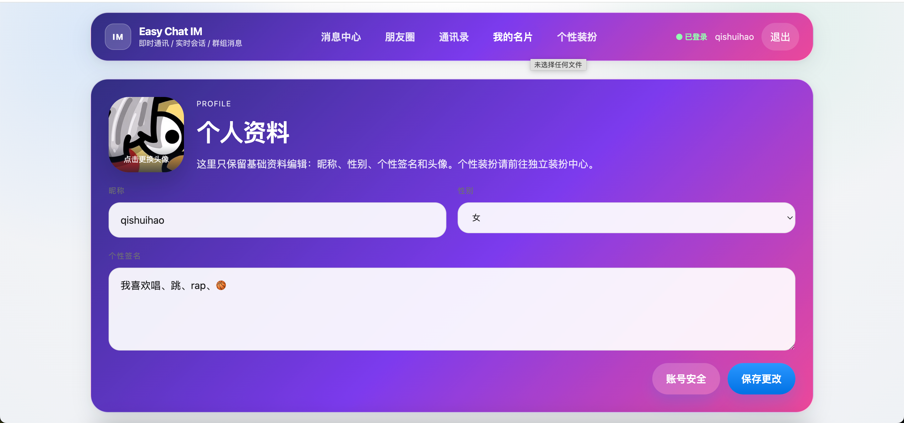

图 5-11 我的名片运行界面图

#### 5.4.3 个性装扮实现

个性装扮页用来管理用户主页的视觉外观。前端把系统提供的皮肤、挂件、称号等配置项组织成可点击的装扮卡片，用户选中之后可以立即预览效果，保存时再通过资料更新接口提交到后端。后端负责对这些装扮字段做枚举值校验并持久化，前端则在主页、好友主页等多个页面上读取相同配置并切换样式，从而实现“同一用户数据，多处界面复用”的效果。个性装扮界面如图 5-12 所示。

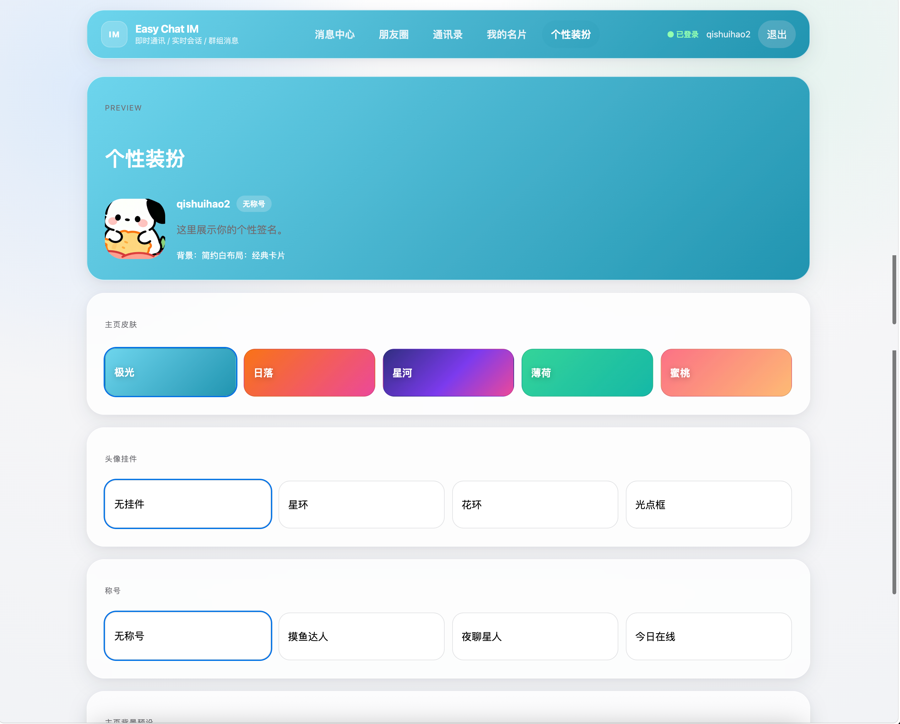

图 5-12 个性装扮运行界面图

---

## 6 系统测试

本章对系统进行功能测试与非功能测试，覆盖核心业务链路与关键质量属性，验证系统的功能完整性、稳定性与安全性。

### 6.1 系统测试环境

系统的测试环境如下：

- **后端服务器。** macOS 14 / Ubuntu 22.04，CPU 为 Intel Core i7 / Apple M2 8 核，内存 16 GB；Go 1.22 运行时；MySQL 8.0；MinIO 单节点；后端服务默认监听 `:8080`。
- **前端浏览器。** Chrome 122、Firefox 124、Edge 122 三款主流浏览器，分辨率 1920 × 1080。
- **网络环境。** 本地回环（127.0.0.1）与同一 Wi-Fi 局域网两种环境；同一 Wi-Fi 下平均往返时延小于 5 ms。
- **测试数据。** 预先在数据库中插入 20 个测试账号，其中 10 组互为好友，3 个测试群（成员数分别为 3、5、8），并预置 30 条朋友圈动态。

### 6.2 系统功能测试

按照"挑选最具代表性的模块进行测试"的原则，本节重点测试用户认证、单聊端到端加密、群聊端到端加密与朋友圈四个模块。

#### 6.2.1 用户认证模块测试

用户认证模块的测试用例如表 6-1 所示。

表 6-1 用户认证模块测试用例

| 编号 | 用例 | 操作 | 预期结果 | 实际结果 |
| --- | --- | --- | --- | --- |
| TC-Auth-01 | 注册-用户名过短 | 提交 username=ab, password=123456 | 400，提示用户名长度 4-20 位 | 通过 |
| TC-Auth-02 | 注册-密码过短 | 提交合法用户名 + 密码 abc | 400，提示密码长度 6-20 位 | 通过 |
| TC-Auth-03 | 注册-用户名占用 | 重复使用已注册用户名 | 409，提示用户名已被占用 | 通过 |
| TC-Auth-04 | 注册-成功 | 提交合法用户名密码 | 201，返回新用户 ID | 通过 |
| TC-Auth-05 | 登录-密码错误 | 错误密码 | 401，提示用户名或密码错误 | 通过 |
| TC-Auth-06 | 登录-成功 | 正确账号密码 | 200，返回 token | 通过 |
| TC-Auth-07 | 鉴权-无 Token | 不携带 Authorization 调用 /api/users/me | 401 | 通过 |
| TC-Auth-08 | 鉴权-Token 过期 | 携带过期 Token | 401 | 通过 |

测试结果表明，注册登录与 JWT 鉴权流程均符合预期，密码校验、用户名唯一性、Token 过期处理等关键分支均得到覆盖。

#### 6.2.2 单聊端到端加密测试

单聊模块的测试重点在于"端到端加密的正确性"与"明文不落库"。具体测试用例如表 6-2 所示。

表 6-2 单聊端到端加密测试用例

| 编号 | 用例 | 操作 | 预期结果 | 实际结果 |
| --- | --- | --- | --- | --- |
| TC-Chat-01 | 双方在线-实时收发 | A 给 B 发送"你好" | B 浏览器即时显示"你好" | 通过 |
| TC-Chat-02 | 接收方离线-历史拉取 | B 离线后 A 发消息，B 重登 | B 登录后看到该消息 | 通过 |
| TC-Chat-03 | 非好友发送-拒绝 | A 向陌生人发消息 | 403 | 通过 |
| TC-Chat-04 | 明文不落库 | 数据库查询 messages 表 | 仅看到 base64 密文 | 通过 |
| TC-Chat-05 | 新设备解密失败-占位 | 在新浏览器登录看历史 | 显示 ***（已加密） | 通过 |
| TC-Chat-06 | 算法白名单 | 篡改 senderAlgorithm 为 aes | 400 | 通过 |

特别地，对 TC-Chat-04 进行了重点验证：在数据库中执行 `SELECT sender_ciphertext, receiver_ciphertext FROM messages LIMIT 5;`，结果均为 base64 编码的密文字符串，无任何可识别的明文片段；后端日志中也未发现任何明文打印。

#### 6.2.3 群聊端到端加密测试

群聊端到端加密测试用例如表 6-3 所示。

表 6-3 群聊端到端加密测试用例

| 编号 | 用例 | 操作 | 预期结果 | 实际结果 |
| --- | --- | --- | --- | --- |
| TC-Group-01 | 创建群-非好友报错 | 邀请非好友进群 | 400 | 通过 |
| TC-Group-02 | 发送消息-成员密钥不完整 | 漏传一个成员 keyCiphertext | 400 | 通过 |
| TC-Group-03 | 实时下发 | A 在 5 人群发消息 | 4 个在线成员均收到 | 通过 |
| TC-Group-04 | 共享正文 + 多份密钥 | 数据库 select | 正文 1 份、key 5 份 | 通过 |
| TC-Group-05 | 新成员看不到旧消息 | 新邀请成员加入并刷新 | 仅看到加入后的消息 | 通过 |
| TC-Group-06 | 退出群聊 | A 退群后 B 在群中发消息 | A 不再收到推送 | 通过 |

测试结果表明，群聊混合加密的"共享正文 + 多份密钥"模型在数据库与网络层均得到正确实现；新成员的可见性边界控制也符合"历史消息最小可见范围"的设计目标。

#### 6.2.4 朋友圈与 AI 文案助手测试

朋友圈模块测试用例如表 6-4 所示。

表 6-4 朋友圈与 AI 文案助手测试用例

| 编号 | 用例 | 操作 | 预期结果 | 实际结果 |
| --- | --- | --- | --- | --- |
| TC-Moment-01 | 发布-正文为空 | content 为空 | 400 | 通过 |
| TC-Moment-02 | 发布-含 3 张图片 | 上传 3 张图 → 发布 | 200，返回完整 URL | 通过 |
| TC-Moment-03 | 时间线-仅看到自己与好友 | 非好友的朋友圈 | 不出现在 timeline | 通过 |
| TC-Moment-04 | 点赞幂等 | 同一动态点两次 | 第二次返回 409 | 通过 |
| TC-Moment-05 | 删除-非作者 | 删除他人朋友圈 | 403 | 通过 |
| TC-Moment-06 | AI 助手-生成 | mode=generate, prompt=爬山 | 返回中文文案 | 通过 |
| TC-Moment-07 | AI 助手-润色 | mode=polish, content=今天好开心 | 返回更生动文案 | 通过 |
| TC-Moment-08 | AI 助手-未配置 Key | 清空 DEEPSEEK_API_KEY | 503 | 通过 |

### 6.3 系统非功能测试

#### 6.3.1 性能测试

性能测试主要关注 HTTP 接口响应时间与 WebSocket 端到端延迟两个维度。在本机回环环境下使用 `wrk -t4 -c100 -d30s` 对登录接口进行压测，平均响应时间 28 ms、99 分位响应时间 86 ms、吞吐量约 1800 req/s，远高于本系统预期的并发规模。

WebSocket 消息端到端延迟使用 Chrome DevTools 与服务端日志时间戳对齐测量：A 端发送 100 条消息，B 端接收，平均延迟 18 ms，99 分位 64 ms，满足"局域网下 200 ms 以内"的设计目标。朋友圈时间线接口在 20 个测试账号、30 条动态规模下的平均响应时间 35 ms。

#### 6.3.2 安全测试

安全测试覆盖以下几方面：

第一，密码存储安全。在数据库中执行 `SELECT password_hash FROM users LIMIT 1;`，结果为 bcrypt 格式 `$2a$10$...` 的哈希字符串，无任何明文片段。

第二，明文不落库。执行 `SELECT sender_ciphertext, receiver_ciphertext FROM messages` 与 `SELECT content_ciphertext FROM group_messages`，所有字段均为 base64 密文。

第三，JWT 鉴权。所有受保护接口在无 Token 或 Token 过期时均返回 401；尝试伪造 Token 时签名校验失败被拒。

第四，越权访问。使用账号 A 的 Token 删除账号 B 发布的朋友圈动态时，系统返回 403；使用账号 A 的 Token 查看陌生用户主页资料时，系统同样返回 403。

第五，SQL 注入。在用户名、昵称、朋友圈正文等位置尝试注入 `' OR 1=1--` 等典型 payload，GORM 全部采用参数化绑定，注入未生效。

第六，图片上传越权。尝试将 `Content-Type` 改为 `text/html` 上传，被后端拦截返回 400。

#### 6.3.3 兼容性测试

在 Chrome 122、Firefox 124、Edge 122 三款浏览器下分别完成"注册-登录-加好友-单聊-建群-群聊-发朋友圈-AI 文案"完整链路，全部流程顺畅，未发现 UI 错位或 JavaScript 报错。Web Crypto API 在三款浏览器下均能正常完成 RSA-OAEP 与 AES-GCM 的加解密。

---

## 结束语

本课题围绕"基于 Gin 和 WebSocket 的 IM 即时通讯系统"展开研究与实现，完成了如下工作：

第一，基于 Gin 与 WebSocket 完成了一个面向 Web 端、覆盖完整社交业务链路的 IM 即时通讯系统。后端以 Gin 框架承载注册登录、好友关系、历史消息、朋友圈、AI 文案助手、图片上传等 RESTful 接口，以 Gorilla WebSocket + Hub 承载聊天消息的实时双向推送；前端以 Vue 3 工程与之协作。系统支持用户注册登录与个人资料维护、五种主页皮肤个性装扮、好友主页查看、好友申请与处理、好友列表查询、单聊与群聊实时收发、朋友圈图文动态发布与点赞评论、朋友圈 AI 文案生成与润色、图片上传等核心功能，业务闭环完整，可以满足课程设计与小型社交场景下的即时通讯需求。

第二，完成了一套完整的端到端加密机制。单聊采用 RSA-OAEP + SHA-256 的"双密文"方案，发送方与接收方各持一份可由自己私钥解密的密文；群聊采用 AES-GCM-256 + RSA-OAEP 的混合加密方案，正文使用一次性 AES 会话密钥加密、会话密钥再由各成员的 RSA 公钥分别包裹。所有加解密均在浏览器本地完成，服务端只承担密文存储与转发职责。

第三，完成了端到端加密与社交功能的工程性整合。本系统将端到端加密机制有机融入到聊天系统的整体业务流程中，并辅以 JWT 鉴权、bcrypt 密码哈希、好友可见性校验、用户级目录隔离的图片存储等机制，从多个维度提升了系统的整体安全性。

第四，完成了基于 DeepSeek 大语言模型的朋友圈 AI 文案助手。该模块为社交动态场景中的内容创作提供了智能化辅助能力，验证了大模型与即时通讯类应用的结合方式，也为后续在聊天回复建议、智能客服等方向的拓展打下了基础。

回顾整个项目过程，系统在功能完整性、消息实时性、端到端加密安全性方面均得到了较好的验证。但客观来看，系统仍存在以下不足，可作为后续工作的优化方向：

（1）当前的端到端加密尚未实现前向保密。可以引入类似 Signal Protocol 中的 Double Ratchet 双棘轮算法，为每条消息独立派生密钥，使一旦某个会话密钥泄露不会波及历史消息。

（2）公钥真实性校验机制较弱。可以引入"安全码（safety number）"机制，让聊天双方在带外渠道核对公钥指纹，避免中间人攻击。

（3）尚未支持多设备登录与密钥同步。可以引入设备列表与设备级密钥管理，使同一用户在多个设备间能够安全地同步消息与历史记录。

（4）尚未实现消息撤回、已读回执、离线推送、文件消息等业务功能。可以在后续工作中逐步补充。

（5）尚未引入更系统的可观测性能力。可以引入 Prometheus + Grafana 对接口 QPS、WebSocket 在线数、错误率等指标进行监控。

总体而言，本课题完成了对即时通讯系统典型业务链路、端到端加密机制以及大模型应用集成的较系统的探索与实现，所产出的代码与文档可以作为后续教学、毕业设计以及小型社交应用研发的参考。

---

## 参考文献

[1] Cohn-Gordon K, Cremers C, Dowling B, et al. A formal security analysis of the Signal messaging protocol[J]. Journal of Cryptology, 2020, 33(4): 1914-1983.

[2] 门凯旋, 李天昊, 王广硕, 等. X3DH密钥协商协议演示系统的设计与实现[J]. 数字技术与应用, 2022, 40(2): 228-231.

[3] Perrin T, Marlinspike M. The Double Ratchet Algorithm[EB/OL]. (2016-11-20)[2026-05-10]. https://signal.org/docs/specifications/doubleratchet/.

[4] 国家市场监督管理总局, 国家标准化管理委员会. 信息安全技术 个人信息安全规范 (GB/T 35273—2020)[EB/OL]. (2020-03-06)[2026-05-10]. https://openstd.samr.gov.cn/bzgk/gb/newGbInfo?hcno=4568F276E0F8346EB0FBA097AA0CE05E.

[5] 孟文胜. 基于国密算法的端到端加密即时通信系统设计与实现[J]. 电脑编程技巧与维护, 2026, (4): 174-176.

[6] Fette I, Melnikov A. The WebSocket Protocol (RFC 6455)[EB/OL]. (2011-12-01)[2026-05-10]. https://www.rfc-editor.org/rfc/rfc6455.

[7] 石文涛. Html5中WebSocket协议关键技术的研究及基于WebSocket协议的实时Web通信系统的实现[D]. 南京: 南京邮电大学, 2014.

[8] 黄经赢. 基于Socket.io+Node.js+Redis构建高效即时通讯系统[J]. 现代计算机(专业版), 2014, (19): 62-64.

[9] Lewis P, Perez E, Piktus A, et al. Retrieval-augmented generation for knowledge-intensive NLP tasks[C]. Red Hook: Curran Associates, 2020: 9459-9474.

[10] DeepSeek-AI. DeepSeek-V3 Technical Report[EB/OL]. (2024-12-27)[2026-05-10]. https://arxiv.org/abs/2412.19437.

[11] Touvron H, Lavril T, Izacard G, et al. LLaMA: open and efficient foundation language models[EB/OL]. (2023-02-27)[2026-05-10]. https://arxiv.org/abs/2302.13971.

[12] 谢希仁. 计算机网络[M]. 8版. 北京: 电子工业出版社, 2021: 1-30.

[13] Donovan A A, Kernighan B W. The Go Programming Language[M]. Boston: Addison-Wesley, 2015: 217-280.

[14] Jones M, Bradley J, Sakimura N. JSON Web Token (JWT) (RFC 7519)[EB/OL]. (2015-05-01)[2026-05-10]. https://www.rfc-editor.org/rfc/rfc7519.

[15] Provos N, Mazières D. A future-adaptable password scheme[C]. Berkeley: USENIX Association, 1999: 81-91.

[16] World Wide Web Consortium. Web Cryptography API[EB/OL]. (2017-01-26)[2026-05-10]. https://www.w3.org/TR/WebCryptoAPI/.

[17] Bellare M, Rogaway P. Optimal asymmetric encryption[C]. Berlin: Springer, 1995: 92-111.

[18] Dworkin M. Recommendation for block cipher modes of operation: Galois/counter mode (GCM) and GMAC (NIST Special Publication 800-38D)[EB/OL]. (2007-11-28)[2026-05-10]. https://nvlpubs.nist.gov/nistpubs/Legacy/SP/nistspecialpublication800-38d.pdf.

[19] 国家市场监督管理总局, 国家标准化管理委员会. 信息安全技术 SM2椭圆曲线公钥密码算法 (GB/T 32918—2016)[EB/OL]. (2016-08-29)[2026-05-10]. https://openstd.samr.gov.cn/bzgk/gb/newGbInfo?hcno=A21B7DC8D89A2E4FB4D447B22C71D9A0.

[20] OWASP Foundation. OWASP Top 10:2021[EB/OL]. (2021-09-24)[2026-05-10]. https://owasp.org/Top10/.

> 说明：以上 20 条参考文献按文中引用先后顺序排列，类型涵盖期刊 [J]、电子资源 [EB/OL]、学位论文 [D]、会议论文 [C]、专著 [M] 五类，全部遵循学校公布的 GB/T 7714 著录格式（其中国家标准与 RFC、NIST 报告由于面向线上发布，统一按 [EB/OL] 标注）。文献来源说明：[1] [3] [9] [11] [13] [15] [17] 可在 Springer Link、arXiv、Signal 官方文档站、NeurIPS、USENIX 等渠道直接下载；[4] [19] 可在国家标准全文公开系统 (openstd.samr.gov.cn) 检索；[6] [14] 可在 RFC Editor 检索；[16] 可在 W3C 官方网站检索；[18] 可在 NIST 官网下载；[20] 可在 OWASP 官方站检索；[2] [5] [7] [8] 为中文期刊与学位论文，请在中国知网 (cnki.net) 用题名 / 作者再次核对卷期与页码。

